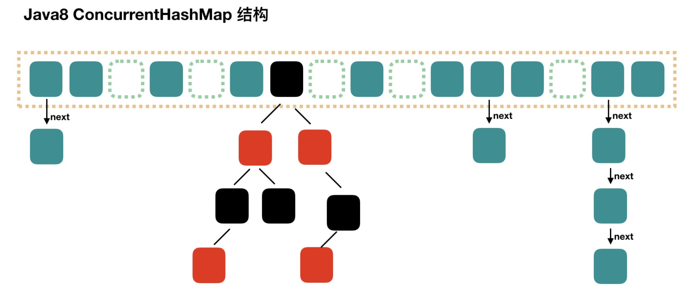

# Map
Map 使用键值对（kye-value）存储，是成对存在的。Key 是无序、不可重复的，value 是无序、可重复的，每个键最多映射到一个值。

Map下主要的实现有：**HashMap**，**HashTable**，**LinkedHashMap**，**TreeMap**，**ConcurrentHashMap**。

## HashMap
HashMap 底层是将数组与链表相结合的数据结构 -- 链表散列，也是线程不安全的。

HashMap 在存储数据的时候流程如下：
1. 将 key 使用扰动函数(hash 方法)处理得到 key 的 hash 值。
2. 通过 (n - 1) & hash 判断当前元素存放的位置（这里的 n 指的是数组的长度）。
3. 如果当前位置存在元素的话，就判断该元素与要存入的元素的 hash 值(hashCode 方法)以及 key(equals 方法)是否相同，如果相同的话，直接覆盖，不相同就通过拉链法解决冲突。

### 扰动函数
扰动函数指的就是 HashMap 的 hash 方法。使用 hash 方法是为了防止一些实现比较差的 `hashCode()` 方法导致 hash 碰撞太多，使用扰动函数之后可以减少碰撞。

JDK 1.8 HashMap 的 hash 方法源码:
```JAVA
static final int hash(Object key) {
  int h;
  // key.hashCode()：返回散列值也就是hashcode
  // ^ ：按位异或
  // >>>:无符号右移，忽略符号位，空位都以0补齐
  return (key == null) ? 0 : (h = key.hashCode()) ^ (h >>> 16);
}
```

JDK 1.7 HashMap 的 hash 方法源码:
```JAVA
static int hash(int h) {
    // This function ensures that hashCodes that differ only by
    // constant multiples at each bit position have a bounded
    // number of collisions (approximately 8 at default load factor).

    h ^= (h >>> 20) ^ (h >>> 12);
    return h ^ (h >>> 7) ^ (h >>> 4);
}
```

相比于 JDK1.8 的 hash 方法 ，JDK 1.7 的 hash 方法因为经过了4次扰动，所以性能会稍差。

### 拉链法
**拉链法**即是指存储值的数组每个元素都是一个链表，当发生 hash 碰撞的时候，将冲突的值加入到链表中，每个数组元素像一条拉链一样往下，如下图：


拉链法也存在着一个弊端，即当发生特别多的 hash 碰撞，数组中保存的链表长度很长的时候，受限于链表结构，检索速度会大大下降。所以在 JDK1.8 以后，当链表长度大于阈值(默认为 8)时，将链表转化为红黑树(将链表转换成红黑树前会判断，如果当前数组的长度小于 64，那么会选择先进行数组扩容，而不是转换为红黑树)，以减少搜索时间。


### 引申出的问题
1. **为什么 HashMap 的长度是2的幂次方？**

  因为 HashMap 本身计算完的hash值是非常大的，内存中无法存放这么大的数组，这个时候就需要设计算法来计算数组的下标了。首要想到的就是使用取模操作来获取数组的下标，但是为了优化计算的性能，当 n（n为数组的长度）为2的幂次方的时候，`(n - 1) & hash ` 等价于 `hash % n`，所以使用
  `(n - 1) & hash ` 来替代取模运算，这个时候 HashMap的长度必须为2的幂次方。

2. **HashMap 多线程死循环问题**

  HashMap在多线程环境下进行 Rehash 的话容易发生循环链表的问题，导致死循环。在 JDK1.8 以后修复了这个问题，但是还是不建议在多线程环境下使用 HashMap，我们可以使用 ConcurrentHashMap。

3. **HashMap 如何判断两个 key 值相等？**

  HashMap 在判断两个 key 值是否相等时会先将 key 值计算 hash，然后通过 hash 值找到保存的数组的指定位置，若不存在元素则表示 key 没有重复，否则再调用 key 的 `equals` 方法判断存储的值是否与当前 key 相等。

  总结起来就是先使用 `hashCode` 方法判断 hash 值是否相等，如果相等再使用 `equals` 方法判断，所以 hash 值相等值不一定相等，值相等 hash 值一定相等。


## HashTable
HashTable 与 HashMap 相似，主要有以下几点不同：

* HashTable 的方法是线程安全的，使用了 `synchronized` 关键词修饰，HashMap 是线程不安全的。
* 因为 HashTable 是线程安全的，使用了 `synchronized`，所以性能会比 HashMap 差。
* HashTable 如果创建时指定大小即为指定大小，否则默认为**11**，扩充时每次为原容量的 **2n + 1**。HashMap 如果你指定了容量，那么会依据你给定的容量扩充为**2的幂次方**，否则默认为**16**，以后扩容每次扩容为**2倍**。
* JDK8 以后，HashMap 在底层链表阈值**大于8**且数组的长度**不小于64**时，会将链表转化为红黑树，而 HashTable 则不会。
* HashMap 允许有一个键值为 null 的元素，且值可以允许有多个 null 值。HashTable 则不允许，会抛出 NPE。

HashTable 是基于 `synchronized` 实现的，读写都需要加锁，所以性能并不是很好，如果在并发环境下可以使用ConcurrentHashMap。

## LinkedHashMap
LinkedHashMap 是继承自 HashMap 的并在 Entry 上额外保存了前一个与后一个元素的引用，这样来确保元素的存储是有序的，LinkedHashMap 默认是按照插入顺序排序，还可以通过参数选择按照访问顺序排序。其他特性比如允许存储 null 值，线程不安全等与 HashMap 一致。


## TreeMap
TreeMap 是基于红黑树实现的带有排序搜索功能的集合，它与 HashMap 一样共同继承自 AbstractMap，但是 TreeMap 额外实现了 NavigableMap 接口，NavigableMap 又实现了 SortedMap 接口，所以 TreeMap 具有排序和搜索功能。

示例：
```JAVA
@Test
void testTreeMap() {
    // 使用 Lambda 表达式传入比较器
    TreeMap<Integer, String> map = new TreeMap<>((item1, item2) -> {
        return Integer.compare(item2, item1);
    });
    map.put(1, "1");
    map.put(3, "3");
    map.put(2, "2");

    map.entrySet().stream().forEach(entry -> {
        System.out.println(entry.getValue());
    });
}
```

结果：

```
3
2
1
```

TreeMap 在使用的时候要求传入的 key 实现了 Comparable 接口，或者传入 Comparator。


## ConcurrentHashMap
ConcurrentHashMap 是线程安全版的 HashMap，相较于 HashMap 的区别就是 ConcurrentHashMap 是加锁的，可在并发环境下使用。与 HashTable 的区别在于 ConcurrentHashMap 使用 synchronized 与 CAS 来保证并发安全，且使用细粒度更低的锁来提高并发性能。

ConcurrentHashMap 在 JDK1.8 版本有个优化，所以前后实现不一致，分别如下：

* JDK1.7 中 ConcurrentHashMap 底层使用分段（Segment）数组和链表的形式来存储，ConcurrentHashMap 在加锁时针对于每个分段使用一把锁，这样在访问不同分段上的数据的时候并不会出现锁竞争的情况，提高了并发性能。


* JDK1.8 中 ConcurrentHashMap 与 HashMap 一样，使用数组与链表或红黑树来存储数据。在加锁的时候 ConcurrentHashMap 针对于数组上的每个链表或红黑树的首节点来加锁，所以只要不发生 hash 冲突就不会出现锁竞争，同样提高了并发性能。



相较于 HashTable 的全表锁，ConcurrentHashMap 性能优异了很多，所以不要使用 HashTable。


## ConcurrentNavigableMap 接口与 ConcurrentSkipListMap 类
ConcurrentNavigableMap 接口继承了 NavigableMap 接口，这个接口提供了针对给定搜索目标返回最接近匹配项的导航方法。

ConcurrentNavigableMap 接口的主要实现类是 ConcurrentSkipListMap 类。ConcurrentSkipListMap 的底层使用的是跳表（SkipList）的数据结构，是线程安全的有序的哈希表，适用于高并发的场景。

相比于 TreeMap 使用红黑树实现的有序哈希表，跳表在插入和删除元素操作上比较简单。

### 跳表
跳表是平衡树的一种替代的数据结构，是基于多层索引来达到加快链表查询速度的，跳表样图如下：


上图中，如果我们要检索15，原有的链表需要逐个遍历，供需要遍历10个节点，如果使用了跳表遍历的话只需要遍历6个节点，效率会提高不少。因为例子中数据量少，当数据量大的时候，跳表提高的效率是非常大的。


## 红黑树
红黑树是一个适度平衡的"二叉平衡树"，它并没有二叉平衡树要求的那么严格，但是相反，它在插入和删除上的性能也要优于二叉平衡树，所以红黑树被广泛运用于很多场景。比如Java的HashMap在数组中链表长度过长的时候就会使用红黑树来替代链表。

红黑树遵循以下5个规则，来确保一颗树是红黑树：
1. 树的节点只有红色和黑色两种。
2. 树的根节点必然是黑色。
3. 树的叶子节点（NIL或空节点）必然是黑色。
4. 树的根节点到任意叶子节点的黑色节点个数相同。
5. 红色节点的子节点是黑色的（即不能出现两个相连的红色父子节点）。

红黑树图：


当在红黑树上插入和删除节点的时候，如果我们插入的节点是黑色，往往会破坏红黑树的规则4，所以插入的时候我们都插入红色的节点，然后再经过红黑树常用的变色、旋转（左旋、右旋）来修正红黑树，以达到符合5个规则的目的。

* 变色：变色即通过改变节点的颜色来修正树。
* 旋转：分为左旋和右旋，操作如下。
  * 左旋：
  
    
  * 右旋：
  
    


## 参考资料
1. [剖析面试最常见问题之 Java 集合框架](https://snailclimb.gitee.io/javaguide/#/docs/java/collection/Java%E9%9B%86%E5%90%88%E6%A1%86%E6%9E%B6%E5%B8%B8%E8%A7%81%E9%9D%A2%E8%AF%95%E9%A2%98?id=_12-collection-%e5%ad%90%e6%8e%a5%e5%8f%a3%e4%b9%8b-list)
2. [最容易懂得红黑树](https://blog.csdn.net/sun_tttt/article/details/65445754)
3. [数据结构与算法——跳表](https://www.jianshu.com/p/fef9817cc943)
4. [同步容器与并发容器](http://concurrent.redspider.group/article/03/15.html)