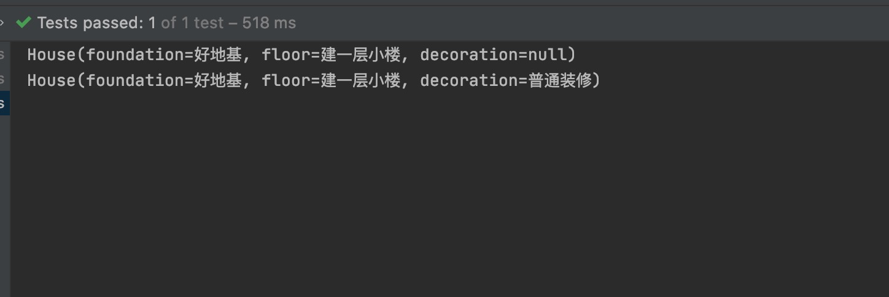

# 创建型-建造者模式

## 定义
指将一个复杂对象的构造与它的表示分离，使同样的构建过程可以创建不同的表示，这样的设计模式被称为建造者模式。它是将一个复杂的对象分解为多个简单的对象，然后一步一步构建而成。它将变与不变相分离，即产品的组成部分是不变的，但每一部分是可以灵活选择的。

## 理解
建造者模式是一个用来建造一些构成比较复杂，构成成分较多且其中一些成分可以自由组合成，导致构建结果呈现出不同状态结果的模式。就比如建造房子，房子建造的流程都差不多，都是先打地基，然后建房子，后面要不要精装修，怎么精装修等，有很多的不同的组合可以选择。再然后比如计算机攒机，基础都一样，要有显示器、主板、cpu等等，但是你可以自由选择加几个内存条，装几块硬盘等。这个复杂的构建过程我们可以通过封装，来将建造过程屏蔽掉，使用者直接获取即可。

## 优点
* 客户端不必知道产品内部组成的细节，将产品本身与产品的创建过程解耦，使得相同的创建过程可以创建不同的产品对象
* 每一个具体建造者都相对独立，与其他的具体建造者无关，因此可以很方便地替换具体建造者或增加新的具体建造者，扩展方便，符合开闭原则
* 可以更加精细地控制产品的创建过程

## 缺点
* 建造者模式所创建的产品一般具有较多的共同点，其组成部分相似，如果产品之间的差异性很大，不适合使用建造者模式，因此其使用范围受到一定的限制
* 如果产品的内部变化复杂，可能会需要定义很多具体建造者类来实现这种变化，导致系统变得很庞大，增加了系统的理解难度和运行成本

## 示例
模式构成主要成员： 

产品（Product）：它是包含多个组成部件的复杂对象，由具体建造者来创建其各个零部件

抽象建造者（Builder）：它是一个包含创建产品各个子部件的抽象方法的接口，通常还包含一个返回复杂产品的方法 getResult()

具体建造者(Concrete Builder）：实现 Builder 接口，完成复杂产品的各个部件的具体创建方法

指挥者（Director）：它调用建造者对象中的部件构造与装配方法完成复杂对象的创建，在指挥者中不涉及具体产品的信息

>以下简单模拟房屋建造来示例建造者模式

1. 构建产品类
```JAVA
@Data
class House {

    // 地基
    private String foundation;
    // 楼层
    private String floor;
    // 装修
    private String decoration;
}
```

2. 构建抽象建造者
```JAVA
interface HouseBuilder {

    // 打地基
    HouseBuilder buildFoundation();

    // 建楼
    HouseBuilder buildFloor();

    // 装修
    HouseBuilder decoration();

    // 提房
    House getHouse();
}
```

3. 实现具体建造者
```JAVA
class NormalHouseBuilder implements HouseBuilder {

    private House house;

    public NormalHouseBuilder() {
        this.house = new House();
    }

    @Override
    public HouseBuilder buildFoundation() {
        house.setFoundation("好地基");

        return this;
    }

    @Override
    public HouseBuilder buildFloor() {
        house.setFloor("建一层小楼");

        return this;
    }

    @Override
    public HouseBuilder decoration() {
        house.setDecoration("普通装修");

        return this;
    }

    @Override
    public House getHouse() {
        return house;
    }
}
```

4. 实现指挥者
```JAVA
class Contractor {

    private HouseBuilder houseBuilder;

    public Contractor(HouseBuilder houseBuilder) {
        this.houseBuilder = houseBuilder;
    }

    /**
     * 精装修房子
     *
     * @return 房子
     */
    public House createHardcoverHouse() {
        return this.houseBuilder.buildFoundation().buildFloor().decoration().getHouse();
    }

    /**
     * 毛坯房子
     *
     * @return 房子
     */
    public House createBlankHouse() {
        return this.houseBuilder.buildFoundation().buildFloor().getHouse();
    }
}
```

5. 测试方法
```JAVA
public void test() {
    // 建筑工人按照包工头指挥怎么建造，是否需要装修
    Contractor contractor = new Contractor(new NormalHouseBuilder());
    // 毛坯房
    System.out.println(contractor.createBlankHouse().toString());
    // 精装修房
    System.out.println(contractor.createHardcoverHouse().toString());
}
```

测试结果：


> 还有一种建造者模式是不需要指挥者，直接合并指挥者和具体建造者，这个是否省略得看具体的情况，如果你有不同的具体建造者类，做了不同的实现，但是生成某个最终产品的流程是一致的，这个时候就不适合省略建造者。指挥者存在目的还是在于通过同一个抽象建造者，依据既定的流程建造指定产品，不需要管内部到底具体用的什么具体建造者实现类，直接能够按照传入的实现类不同生产出不同的产品。

## 总结
建造者模式可以帮助我们屏蔽掉复杂的对象构建过程，维护对象的构建只需在特定的类中维护即可，拓展也方便，使用的时候完全不需要管是如何实现的，低耦合，在特定的场景中还是非常好用的。

## 参考资料
1. [Java 设计模式——建造者模式（Builder Pattern）](https://www.jianshu.com/p/47329a94f5dc)
2. [建造者模式（Bulider模式）详解](http://c.biancheng.net/view/1354.html)
3. [设计模式之：建造者模式](https://blog.csdn.net/yitian_z/article/details/103107540)