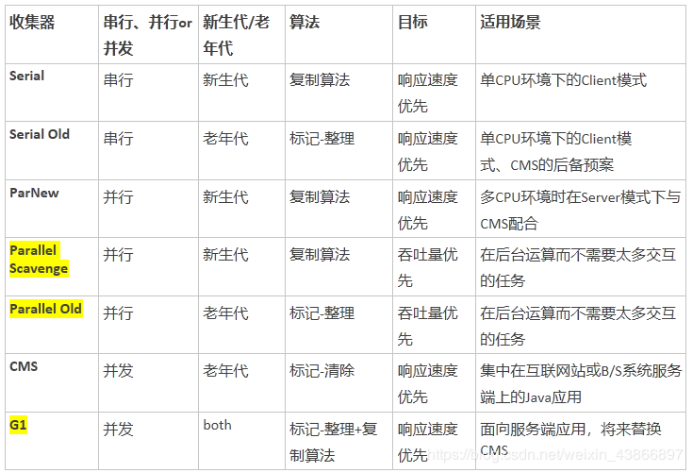

# 垃圾收集
垃圾自动收集是Java语言的一大优势点，JVM可以自动帮助程序员分配，释放内存，无需程序员自行对内存进行管理。

因为虚拟机栈、本地方法栈与程序计数器都是线程独享的部分，生命周期随着线程的死亡而自然被回收掉，但是堆内存和方法区是线程共享的，垃圾回收器就是需要关注这部分的内存。

那么到底什么样的对象是需要被当做垃圾收集，什么时候去收集呢？

## 如何判断一个对象需要被回收

### 回收算法
判断对象是否需要被回收主要有两种方法：

* 引用计数器计算：给对象添加一个引用计数器，每次引用这个对象时计数器加一，引用失效时减一，计数器等于0时就是不会再次使用的。不过这个方法有一种情况就是出现对象的循环引用时GC没法回收。
* 可达性分析计算：这是一种类似于二叉树的实现，将一系列的GC ROOTS作为起始的存活对象集，从这个节点往下搜索，搜索所走过的路径成为引用链，把能被该集合引用到的对象加入到集合中。搜索当一个对象到GC Roots没有使用任何引用链时，则说明该对象是不可用的。主流的商用程序语言，例如Java，C#等都是靠这招去判定对象是否存活的。

  **可达性分析演示图**：
  

  可作为GC ROOTS对象的有如下几种：
  * Java虚拟机栈中被引用的对象，各个线程调用的参数、局部变量、临时变量等。
  * 方法区中类静态属性引用的对象，比如引用类型的静态变量。
  * 方法区中常量引用的对象。
  * 本地方法栈中所引用的对象。
  * Java虚拟机内部的引用，基本数据类型对应的Class对象，一些常驻的异常对象。
  * 被同步锁（synchronized）持有的对象。

### 对象拯救
当一个对象被可达性分析后标记为回收对象后，不一定会被回收，因为要真正宣告一个对象的死亡，至少需要两次标记。
如果对象在可达性分析之后没有发现与GC Roots相连接的引用链，那它将会被第一次标记并执行一次筛选，筛选的条件是此对象是否有必须要执行的finalize方法。当对象
* **没有重写finalize对法**
* **finalize方法已经被虚拟机调用过**

虚拟机将以上两种情况视为”没有必要执行finalize“，之后会回收它们。

如果这个对象被判定为有必要执行finalize方法，这个对象就会被放置在一个叫F-Queue的队列之中，并在稍后会由虚拟机自动创建一个低优先级的Finalizer线程去执行它。

这个线程执行只会触发这个方法，并不一定会等它运行结束，这样做的原因是：防止因为一个对象在finalze方法中执行缓慢或死循环，而导致F-Queue队列中其他对象处于永久等待状态，甚至导致整个内存回收系统崩溃。

finalize方法是对象逃脱死亡命运的最后一次机会，稍后GC将会对F-Queue队列中的对象进行第二次小规模的标记，如果对象在finalize方法中重新与引用链上的任何一个对象建立联系，就可以拯救自己。如：把自己（this关键字）赋值给某个类变量或者对象的成员变量，那在第二次标记时，它将被移除”即将回收“的集合。否则，基本上它就被真正回收了。

**finalize方法**：

finalize()是Object类的一个方法、一个对象的finalize()方法只会被系统自动**调用一次**，经过finalize()方法逃脱死亡的对象，**第二次不会再调用**。

补充一句：并不提倡在程序中调用finalize()来进行自救。建议忘掉Java程序中该方法的存在。因为它执行的时间不确定，甚至是否被执行也不确定（Java程序的不正常退出），而且运行代价高昂，无法保证各个对象的调用顺序（甚至有不同线程中调用）。在Java9中已经被标记为 deprecated ，且java.lang.ref.Cleaner（也就是强、软、弱、幻象引用的那一套）中已经逐步替换掉它，会比finalize来的更加的轻量及可靠。

流程示意图：

## 垃圾回收算法
当我们认定对象死亡以后，接下来GC要做的就是回收这些死亡对象了，主要的回收算法有如下几种：

* **标记-清除算法**：标记-清除算法即先对要回收的对象进行标记，标记结束后统一再对对象进行回收，如下图：

  

  从图中可以看出来回收完以后的堆内存是非常碎片化的，当我们想要给大内存对象分配空间的时候，可能会找不到足够大的连续内存空间，不得不继续进行垃圾回收来找到足够的空间。同时这种方法会有大量的标记-清除动作，势必导致回收效率低下。

* **标记--复制算法**：标记-复制算法是通过预留一部分的堆内存空间不使用，当垃圾回收得时候，将存活的对象一起复制至这块不适用的空间，并清理原空间中的死亡对象，这样原空间又空出来了，循环往复。如下图：

  

  在Java运行时数据区堆内存空间的年轻代中就使用到了**标记--复制算法**，具体内容可以参照[运行时数据区-堆-共享](https://kai-keng.github.io/java-learning/jvm/runtime-data-area.html#%E5%A0%86-%E5%85%B1%E4%BA%AB)。

  这个算法的弊端也非常明显，会使堆内存空间的使用率非常的低，且当对象存活率高的时候，需要复制大量的存活对象，效率会很低。

* **标记--整理算法**：标记--整理算法是一种折中的垃圾回收算法，它也是先进行标记，标记以后会将存活对象统一向一端移动，然后直接清理存活对象以外区域的对象家就好了。如下图：

  

  但是该算法在回收时需要暂停所有用户线程，特别是老年代对象回收的时候需要更长的时间，对用户来说不是很友好。

* **分代-收集算法**：这种算法与上面不同，它并没有提出新的收集方式，而是根据对象存活的时间长短将内存进行了分区，针对于不同的区域实施不同的收集算法。Java就分成了老年代和年轻代，年轻代对象存活时间短，经常有大批量对象死亡，这个时候就适合**标记-复制算法**，只需复制少量对象即可完成收集。而老年代中对象存活时间长，则适合使用**标记-清理算法**或**标记-整理算法**。

## 垃圾回收器
HotSpot VM中的垃圾回收器，以及适用场景：

到jdk8为止，默认的垃圾收集器是**Parallel Scavenge** 和 **Parallel Old**。

从jdk9开始，**G1收集器**成为默认的垃圾收集器。目前来看，G1回收器停顿时间最短而且没有明显缺点，非常适合Web应用。在jdk8中测试Web应用，堆内存6G，新生代4.5G的情况下，Parallel Scavenge 回收新生代停顿长达1.5秒，G1回收器回收同样大小的新生代只停顿0.2秒。

## 参考资料
1. [大白话带你认识JVM](https://juejin.im/post/6844904048013869064#heading-2)
2. [别再说自己不会JVM了，看完这篇能和面试官扯上半小时](https://juejin.im/post/6856958647445291021#heading-1)