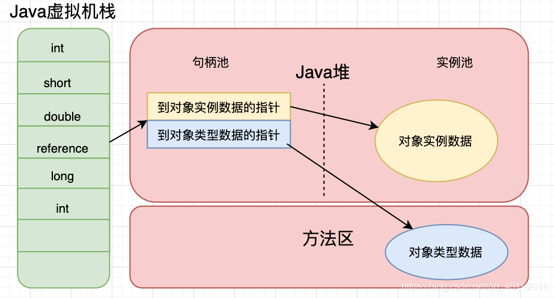
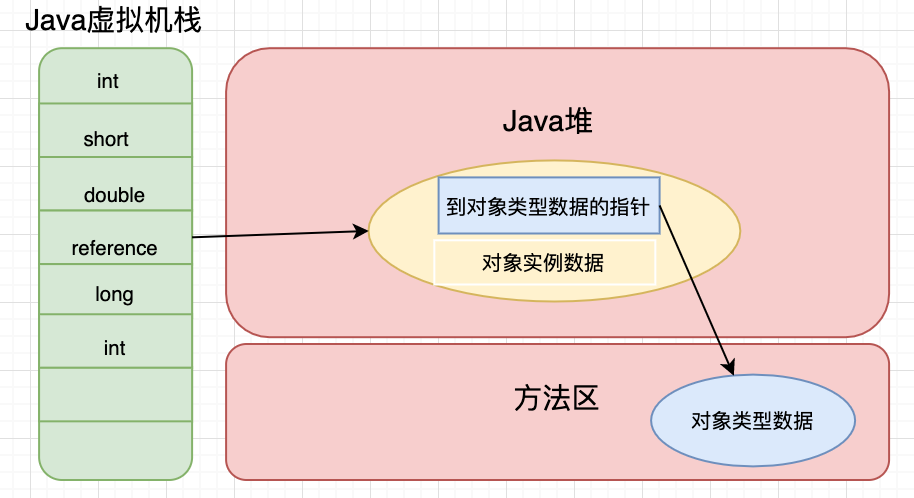

# Java文件运行过程及对象的创建和访问

## 运行过程
我们在编写源代码的时候写的都是`.java`文件，那么JVM是如何运行我们的文件的呢？比如如下代码：

学生类：
```JAVA
public class Student {
    private String name;
    
    public Student(String name) {
        this.name = name;
    }
    
    public void sayName() {
        System.out.println("student's name is " + this.name);
    }
}
```

main方法：
```JAVA
public class App {
    public static void main(String[] args) {
        Student student = new Student('tellUrDream');
        student.sayName();
    }
}
```

执行main方法的流程如下：

1. 编译Student.java和App.java文件为class文件后执行App.class，系统启动一个JVM进程，从classpath路径中找到App.class，将App的类信息加载至方法区内，这个过程是App的类加载。
2. JVM找到App主程序入口，执行main方法。
3. 第一条语句是`Student student = new Student("tellUrDream");`，会让JVM去创建一个Student对象，但是此时方法区没有Student的类信息，所以JVM会马上去加载Student.class到方法区中。
4. 加载完Student类以后，JVM会在堆中为Student实例分配内存，然后调用构造函数实例化Student类，这个Student持有指**向方法区中Student类信息的引用**。
5. 当执行`student.sayName();`时，JVM根据student引用找到student对象，然后依据对象中类信息的引用找到类信息，查询类信息中的方发表，获得sayName方法的字节码地址并执行sayName方法。

以上就是执行的大致流程，执行代码主要是经历以下几个步骤：

1. `.java`文件被编译器编译成`.class`字节码文件
2. 类加载器将字节码文件加载至JVM中
3. JVM依据加载到方法区中的类信息创建对象
4. 依据对象的引用于类信息的引用获取各种执行所需信息，并执行


## 对象的创建和访问

### 内存分配
从上面描述的流程我们可以知道，对象的创建是先会判断对象的类信息是否被加载进入了方法区，如果没有加载进入方法区的话，会先将对象信息加载进入方法区，然后再为对象分配内存，分配内存有两种方式：
* 指针碰撞：通过一个类似于指针的东西为对象分配内存，前提是堆空间是相对规整的。
* 空闲列表：堆空间不规整，使用一个列表记录了哪些空间是空闲的，分配内存的时候会更新列表。

### 对象结构
在对象中还会保存对象的类信息的引用，那么对象是怎么保存引用的？是个什么样的结构呢？

对象在堆中的存储布局可以分为三个部分：
* 对象头
  * 第一类信息：存储对象自身的运行时数据，例如哈希码、GC分代年龄、锁状态标志等等。
  * 第二类信息：指针类型，Java虚拟机通过这个指针来确定该对象是那个类的实例。
* 实例数据：对象真正存储的有效信息。
* 对齐填充：没有实际的意义，起着占位符的作用。

### 对象访问
从上篇Java运行时数据区的虚拟机栈描述我们知道，虚拟机栈保存的是基本数据类型和对象的引用，那么对象的引用是怎么访问的呢？

对象实例存储在Java堆中，通过这个对象引用我们就可以找到对象在堆中的位置。但是，对于如何定位到这个对象，不同的Java虚拟机又有不同的方法。

通常情况下，有下面两种方法：
* 使用句柄访问，通常会在Java堆中划分一块句柄池。
* 使用直接指针，这样Java虚拟机栈中存储的就是该对象在堆中的地址。

**句柄访问方式：**


使用句柄访问，当对象发生移动的时候，可以不用改变栈中存储的reference，只需要改变句柄池中实例数据的指针。


**直接指针访问方式：**


使用直接指针进行访问，可以直接定位到对象，减小了一次指针定位的时间开销（使用句柄的话会通过句柄池的指针二次定位对象），最大的好处就是速度更快。


## 参考资料
1. [大白话带你认识JVM](https://juejin.im/post/6844904048013869064#heading-2)
2. [别再说自己不会JVM了，看完这篇能和面试官扯上半小时](https://juejin.im/post/6856958647445291021#heading-1)