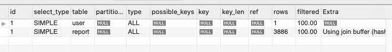
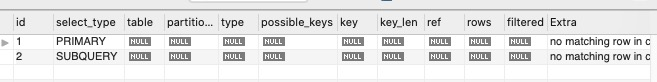
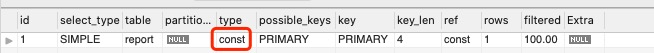
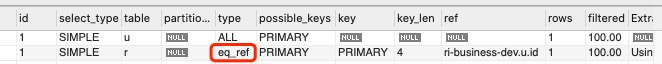
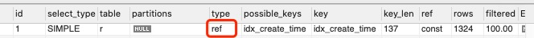
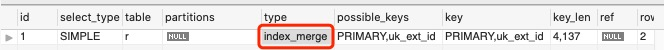
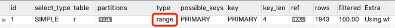
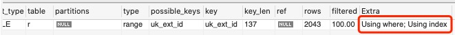
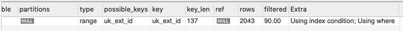

# Explain（执行计划）字段解析
使用EXPLAIN关键字可以模拟优化器执行SQL查询语句，从而知道MySQL是如何处理你的SQL语句的。分析你的查询语句或是表结构的性能瓶颈。

执行计划分析结果中包含有很多字段，各字段代表含义如下：

## id
select查询的序列号，包含一组数字，表示查询中执行select子句或操作表的顺序。

如果在语句中没有子查询或关联查询，只有唯一的select，每行都将显示1.否则，内层的select语句一般会顺序编号，对应于其在原始语句中的位置。

id的结果共有3中情况:

* id相同，执行顺序由上至下

```SQL
EXPLAIN SELECT * FROM report,user;
```



* id不同，如果是子查询，id的序号会递增，id值越大优先级越高，越先被执行

```SQL
EXPLAIN SELECT * FROM report WHERE id = ( SELECT id FROM user WHERE id = 1 );
```



* id相同不同，同时存在，与上面一样，同id从上往下执行，id越大优先级越高


## select_type
用来表示查询的类型，主要是用于区别普通查询、联合查询、子查询等的复杂查询。所有的值如下：

* SIMPLE：简单的 SELECT 查询，查询中**不包含子查询或者 UNION**。
* PRIMARY：PRIMARY 查询中若包含**任何复杂的子部分**，**最外层查询**则被标记为 PRIMARY。
* SUBQUERY：在 SELECT 或 WHERE 列表中**包含了子查询**。
* DERIVED：在 **FROM 列表中包含的子查询**被标记为 DERIVED（衍生），MySQL 会递归执行这些子查询，把结果放在临时表中。
* UNION：若第二个 SELECT 出现在 UNION 之后，则被标记为 UNION。若 UNION 包含在 FROM 子句的子查询中，外层 SELECT 将被标记为 DERIVED。
* UNION RESULT：从 UNION 表获取结果的 SELECT。


## table
指的是当前执行引用哪个表。


## type
type所显示的是查询使用了哪种类型，type包含的类型包括如下几种：

* system：表只有一行记录，这是const类型的特列，平时不会出现，可忽略不计。

* const：表示只通过一次索引便找到了数据，常出现与主键或唯一索引与常量值比较的场景，此时性能最佳。

```SQL
EXPLAIN SELECT * FROM report WHERE id = 1;
```



* eq_ref：唯一性索引扫描，对于每个索引键，表中只有一条记录匹配。常见于主键或非空唯一索引，比如两张表使用主键连表时，就是 eq_ref。

```SQL
EXPLAIN SELECT * FROM report as r, user as u WHERE r.id = u.id;
```



* ref：非唯一性索引扫描，即刚好与 eq_ref 相反，使用非主键和唯一索引匹配指定值的时候，使用的就是 ref。

```SQL
-- type_name为非唯一索引
EXPLAIN SELECT * FROM report as r WHERE r.type_name = '测试数据';
```



* ref_or_null：与 ref 类似，附加了对 NULL 值列的查询。

* index_merge：索引合并，当我们查询条件使用了多个索引字段进行 OR，AND 操作的时候会进行索引合并，将索引各自的结果值进行合并。

```SQL
EXPLAIN SELECT * FROM report as r WHERE r.id = 1 OR r.ext_id = "1";
```



* range：范围索引扫描，检索指定范围的索引。一般出现于条件语句中有 between，<，>，in 等查询的时候，性能优于全索引扫描。

```SQL
EXPLAIN SELECT * FROM report as r WHERE r.id > 1;
```



* index：全索引扫描，遍历所有索引，相比于全表扫描较好，但是也算是性能比较差的级别了，常见于无条件查询[覆盖索引](https://kai-keng.github.io/java-learning/mysql/mysql-index.html#%E7%B4%A2%E5%BC%95%E4%BD%BF%E7%94%A8%E5%9C%BA%E6%99%AF%EF%BC%88%E9%87%8D%E7%82%B9%EF%BC%89)的情况。

```SQL
EXPLAIN SELECT id FROM report as r;
```


* all：全表扫描，最差的情况，会扫描整张表，查询效率很低。

```SQL
EXPLAIN SELECT * FROM report as r WHERE r.type_id = '1';
```


> 注意，阿里巴巴JAVA开发手册中规定，我们书写的 SQL 至少要达到 range 级别，要求是 ref 级别。

## possible_keys 与 key
possible_keys 表示哪些索引可以应用到此次查询中用于优化，key 表示 MySQL 实际使用的索引。若执行计划 key 为非空则表示使用了索引，反之表示未使用到索引。

```SQL
EXPLAIN SELECT id FROM report as r WHERE r.id > 1;
```


上图中 possible_keys 为 `PRIMARY,idx_create_time`，key 为 `PRIMARY`。表示可以使用的索引有**主键索引和 idx_create_time 索引**，实际使用的是**主键索引**。

## key_len
表示索引中使用的字节数，可通过该列计算查询中使用的索引的长度，长度越长查询精度越高，**但是在不损失精确性的情况下，长度越短越好**（涉及 B+树原理，长度越短能减低树的深度，减少 io 次数，提高性能）。key_len 显示的值为索引字段的最大可能长度，并非实际使用长度，即 key_len 是根据表定义计算而得，不是通过表内检索出的。

## ref
显示索引的那一列被使用了，如果可能的话，最好是一个常数。哪些列或常量被用于查找索引列上的值。

## rows
根据表统计信息及索引选用情况，大致估算出找到所需的记录所需要读取的行数，也就是说，用的越少越好。

## Extra
Extra 列主要用于显示额外的信息，常见信息及其含义如下：
* Using where: 表示 MySQL 服务器在存储引擎收到记录后使用了 where 条件进行过滤。

* Using filesort：表示MySQL不会按照表内索引顺序读取，会使用外部索引排序。在MySQL中无法利用索引完成的排序操作被称为**文件排序**。

* Using temporary：表示使用了临时表保存中间结果。MySQL在对查询结果排序或分组是使用了临时表，常见于 `ORDER BY` 与 `GROUP BY`。

* Using index：表示查询中使用了[覆盖索引](https://kai-keng.github.io/java-learning/mysql/mysql-index.html#%E7%B4%A2%E5%BC%95%E4%BD%BF%E7%94%A8%E5%9C%BA%E6%99%AF%EF%BC%88%E9%87%8D%E7%82%B9%EF%BC%89)，避免了回表查询。但是有时会与 `Using where` 同时出现，表示非直接查询[覆盖索引](https://kai-keng.github.io/java-learning/mysql/mysql-index.html#%E7%B4%A2%E5%BC%95%E4%BD%BF%E7%94%A8%E5%9C%BA%E6%99%AF%EF%BC%88%E9%87%8D%E7%82%B9%EF%BC%89)数据，并且索引被用来执行索引值的查找。通俗来讲就是只有 `Using index` 的时候表示只是简单查询[覆盖索引](https://kai-keng.github.io/java-learning/mysql/mysql-index.html#%E7%B4%A2%E5%BC%95%E4%BD%BF%E7%94%A8%E5%9C%BA%E6%99%AF%EF%BC%88%E9%87%8D%E7%82%B9%EF%BC%89)，同时出现则表示还使用了索引作为查询项查询过滤。

  ```SQL
  EXPLAIN SELECT ext_id FROM report as r WHERE  ext_id != '4028e5f661e121980161ef964e7d106e';
  ```

  

* Using index condition：MySQL5.6 版本后新加入的，表示先对索引值进行了过滤，过滤后会找到所有的数据行（回表），如果同时有 `Using where`，则会在找到数据行以后再使用 where 过滤。

  ```SQL
  EXPLAIN SELECT ext_id FROM report as r WHERE  ext_id != '4028e5f661e121980161ef964e7d106e' AND author_id != "1" ;
  ```

  

* Using join buffer：表明表连接的时候使用了连接缓存。

* impossible where：表明 where 查询的值总是 false，无法用来查询到确切数据。

## 参考资料
1. [MySQL中explain用法和结果分析（详解）](https://www.php.cn/mysql-tutorials-454417.html)
2. [没内鬼，来点干货！SQL优化和诊断](https://juejin.im/post/6844904135964229646#heading-1)