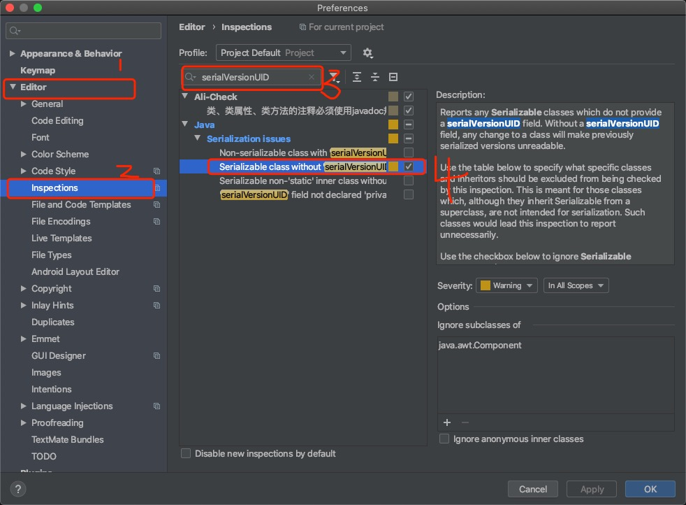
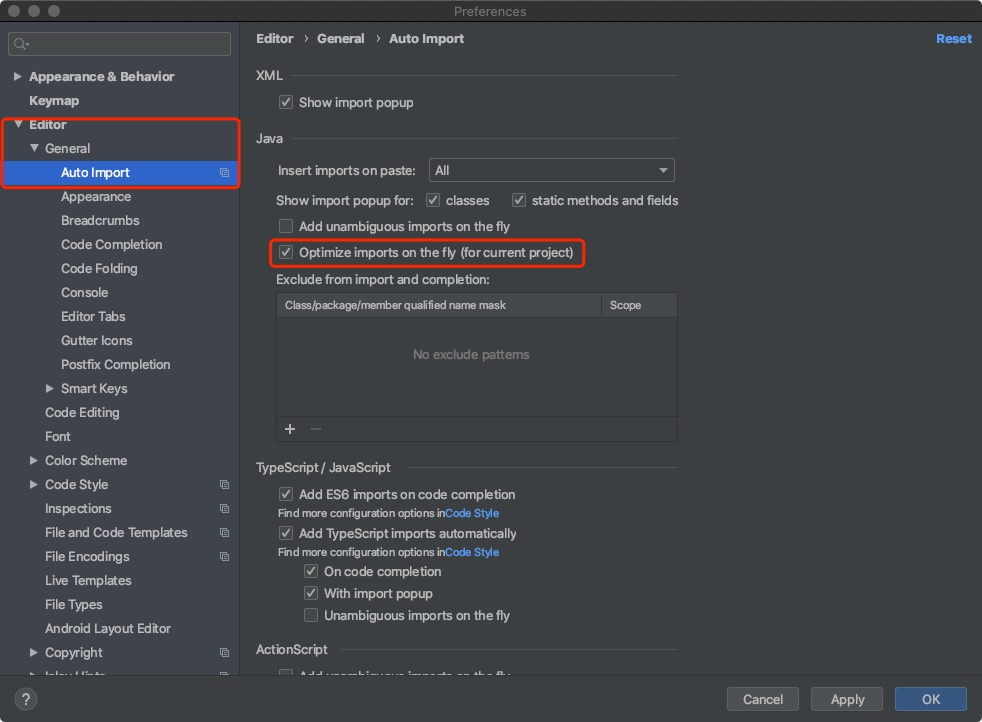

# IDEA 相关配置介绍

## 配置序列化ID点击自动生成
在实体类实现Serializable接口以后，我们需要创建一个**serialVersionUID**来控制实体类版本，但是这个手动添加的话我们并不知道改填什么值好，在使用IDEA开发的时候可以直接自动生成，但是需要开启配置，开启方式如下：
1. 打开设置 -> 选择**Editor** -> 选择**inspections**
2. 搜索**serialVersionUID** -> 勾选**Serializable class without serialVersionUID**即可

## 配置自动清理无用包
1. 打开设置 -> 选择**Editor** -> 选择**General** -> 选择**Auto Import**
2. 勾选**Optimize imports on the fly**

## END
**作者**: Borg

**创建时间**: 2020-07-08 10:15 周三

**最后更新时间**: 2020-07-08 10:15 周三