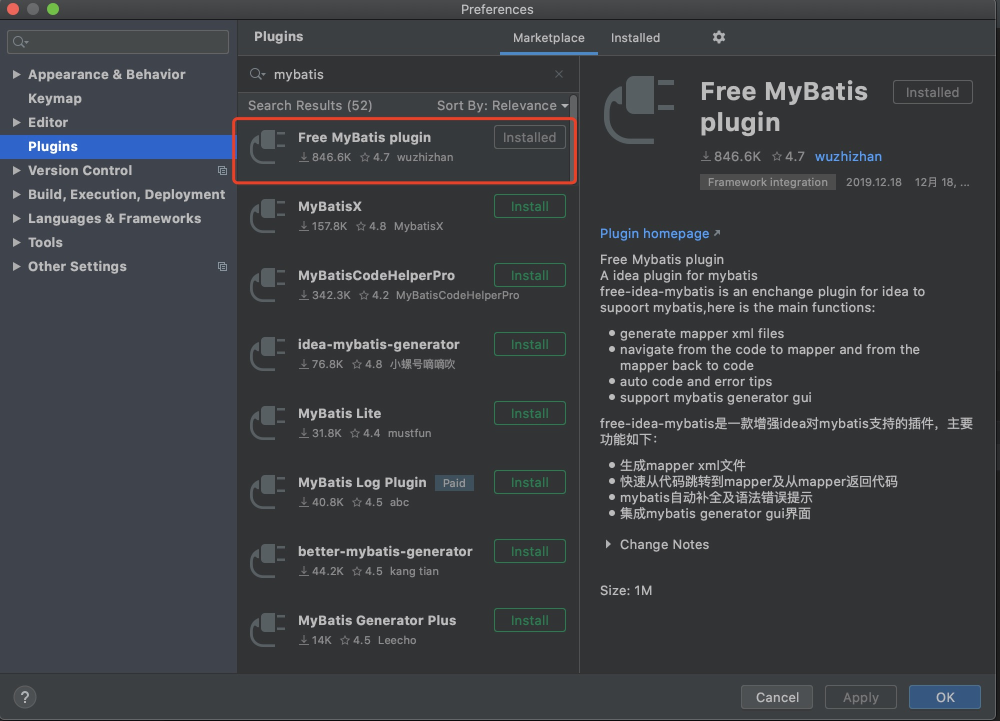
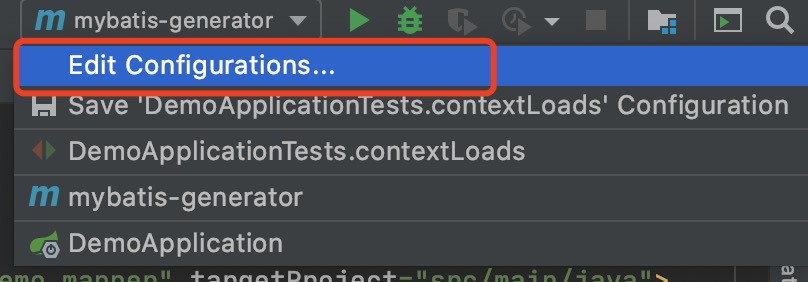

# Mybatis自动化便捷操作

## 依据库表自动生成代码

### 介绍
某些情况下，我们需要依据表结构来写我们的DTO对象与DAO层代码，但是手动写起来会很麻烦，这个时候可以用上mybatis-generator来自动生成代码

### 实现
1. **IDEA下载MyBatis Generator插件**



2. **pom.xml文件添加插件配置信息**

```XML
<!-- mybatis generator 自动生成代码插件 -->
<plugin>
    <groupId>org.mybatis.generator</groupId>
    <artifactId>mybatis-generator-maven-plugin</artifactId>
    <version>1.3.5</version>
    <dependencies>
        <dependency>
            <!-- 数据库连接驱动 -->
            <groupId>mysql</groupId>
            <artifactId>mysql-connector-java</artifactId>
            <version>8.0.20</version>
        </dependency>
        <dependency>
            <groupId>tk.mybatis</groupId>
            <artifactId>mapper</artifactId>
            <version>3.4.4</version>
        </dependency>
    </dependencies>
    <executions>
        <execution>
            <id>Generate MyBatis Artifacts</id>
            <phase>package</phase>
            <goals>
                <goal>generate</goal>
            </goals>
        </execution>
    </executions>
    <configuration>
        <!--配置文件的位置-->
        <configurationFile>src/main/resources/mybatis-generator.xml</configurationFile>
        <overwrite>true</overwrite>
        <verbose>true</verbose>
    </configuration>
</plugin>
```

3. **添加mybatis-generator配置信息**

```XML
<?xml version="1.0" encoding="UTF-8"?>
<!DOCTYPE generatorConfiguration
        PUBLIC "-//mybatis.org//DTD MyBatis Generator Configuration 1.0//EN"
        "http://mybatis.org/dtd/mybatis-generator-config_1_0.dtd">
<generatorConfiguration>
    <context id="DB2Tables" targetRuntime="MyBatis3">

        <plugin type="tk.mybatis.mapper.generator.MapperPlugin">
            <!-- 该配置会使生产的Mapper自动继承MyMapper -->
            <property name="mappers" value="com.example.demo.config.MyMapper" />
            <!-- caseSensitive默认false，当数据库表名区分大小写时，可以将该属性设置为true -->
            <property name="caseSensitive" value="false"/>
        </plugin>

        <commentGenerator>
            <property name="suppressDate" value="true"/>
            <!-- 是否去除自动生成的注释 true：是 ： false:否 -->
            <property name="suppressAllComments" value="true"/>
        </commentGenerator>
        <!--数据库链接URL，用户名、密码 -->
        <jdbcConnection driverClass="com.mysql.jdbc.Driver" connectionURL="jdbc:mysql://localhost:3306/ri-business-dev" userId="root" password="123456">
        </jdbcConnection>
        <javaTypeResolver>
            <property name="forceBigDecimals" value="false"/>
        </javaTypeResolver>
        <!-- 生成模型的包名和位置-->
        <javaModelGenerator targetPackage="com.example.demo.model.vo" targetProject="src/main/java">
            <property name="enableSubPackages" value="true"/>
            <property name="trimStrings" value="true"/>
        </javaModelGenerator>
        <!-- 生成映射文件的包名和位置-->
        <sqlMapGenerator targetPackage="main.resources.mapper" targetProject="src">
            <!-- enableSubPackages:是否让schema作为包的后缀 -->
            <property name="enableSubPackages" value="false" />
        </sqlMapGenerator>
        <!-- 生成DAO的包名和位置-->
        <javaClientGenerator type="XMLMAPPER" targetPackage="com.example.demo.mapper" targetProject="src/main/java">
            <property name="enableSubPackages" value="true"/>
        </javaClientGenerator>
        <!-- 要生成的表 tableName是数据库中的表名或视图名 domainObjectName是实体类名-->
        <table tableName="reports"
               domainObjectName="Report"
               enableCountByExample="false"
               enableUpdateByExample="false"
               enableDeleteByExample="false"
               enableSelectByExample="false"
               selectByExampleQueryId="false">

        </table>

    </context>
</generatorConfiguration>
```

4. **Configure配置启动**

* 添加新的配置项
  

* 在Command Line中添加 **mybatis-generator:generate -e**
  

5. **按照以上操作完了以后就可以运行了，运行完成以后会在指定位置生成DTO、Mybatis映射xml与DAO了**

## 配置通用化mapper

### 介绍
日常业务开发中，经常需要对单表的数据做一些增删改查的操作，使用Mybatis的话，也需要针对不同的表去写不同的Mapper，这个过程是重复的，比较浪费时间。针对于这个情况，我们可以配置Mybatis通用化的mapper，共用一些比较重复性的检查操作，比如主键查询数据，新增数据，更新删除等。

### 实现

1. pom.xml文件引入*mapper-spring-boot-starter*依赖
```XML
<dependency>
    <groupId>tk.mybatis</groupId>
    <artifactId>mapper-spring-boot-starter</artifactId>
    <version>1.1.5</version>
</dependency>
```

2. 创建共用mapper接口集成通用Mapper和MySqlMapper
> 注意公用mapper接口要和普通mapper分开存放，以免启动类的@MapperScan扫描到会报错
```JAVA
public interface MyMapper<T> extends Mapper<T>, MySqlMapper<T> {}
```

3. 配置文件除普通的数据库连接信息以外，添加额外的配置mapper配置
```YAML
#mybatis配置
mybatis:
  #实体类所在包名
  type-aliases-package: com.example.demo.model.dto
  # mapper xml实现扫描路径
  mapper-locations: classpath:mapper/*.xml
  property:
    order: BEFORE
#通用mapper配置
mapper:
  #公用接口类路径
  mappers: com.example.demo.config.MyMapper
  identity: MYSQL
```

4. 实现共用服务接口类
```JAVA
@Service
public interface IService<T> {

    List<T> selectAll();

    T selectByKey(Object key);

    int save(T entity);

    int delete(Object key);

    int updateAll(T entity);

    int updateNotNull(T entity);

    List<T> selectByExample(Object example);
}
```

5. 实现共用基础服务抽象类
```JAVA
public abstract class BaseService<T> implements IService<T> {

    // Mapper为 tk.mybatis.mapper.common.Mapper 包下的
    @Autowired
    protected Mapper<T> mapper;

    public Mapper<T> getMapper() {
        return mapper;
    }

    @Override
    public List<T> selectAll() {
        //说明：查询所有数据
        return mapper.selectAll();
    }

    @Override
    public T selectByKey(Object key) {
        //说明：根据主键字段进行查询，方法参数必须包含完整的主键属性，查询条件使用等号
        return mapper.selectByPrimaryKey(key);
    }

    @Override
    public int save(T entity) {
        //说明：保存一个实体，null的属性也会保存，不会使用数据库默认值
        return mapper.insert(entity);
    }

    @Override
    public int delete(Object key) {
        //说明：根据主键字段进行删除，方法参数必须包含完整的主键属性
        return mapper.deleteByPrimaryKey(key);
    }

    @Override
    public int updateAll(T entity) {
        //说明：根据主键更新实体全部字段，null值会被更新
        return mapper.updateByPrimaryKey(entity);
    }

    @Override
    public int updateNotNull(T entity) {
        //根据主键更新属性不为null的值
        return mapper.updateByPrimaryKeySelective(entity);
    }

    @Override
    public List<T> selectByExample(Object example) {
        //说明：根据Example条件进行查询
        //重点：这个查询支持通过Example类指定查询列，通过selectProperties方法指定查询列
        return mapper.selectByExample(example);
    }
}
```

6. 实现业务服务接口继承共用服务接口,可自定义业务方法
```JAVA
public interface ReportService extends IService<Report> {}
```

7. 实现业务服务类，继承共用抽象服务类，实现业务接口
```JAVA
@Service("reportService")
public class ReportServiceImpl extends BaseService<Report> implements ReportService {}
```

8. 在控制层调用服务即可
```JAVA
@Validated
@RestController
@RequestMapping("/report")
public class ReportController {

    @Autowired
    ReportService reportService;

    @GetMapping(value = "/{id}/info")
    public Report getReportById(@PathVariable @NotNull Integer id) {
        return reportService.selectByKey(id);
    }
}
```

### 注意
1. 启动类必须添加上`@MapperScan("com.example.demo.mapper")`，不然会报错Service找不到`tk.mybatis.mapper.common.Mapper`的bean

## 使用PageHelper简化分页

### 介绍
分页是我们业务中很常见的需求，如果我们自己去处理分页的话，需要在mapper中相应的添加上分页参数，拼接上去。但是如果用上了PageHelper插件，就可以很简单的完成分页的功能。

### 实现

1. 引入PageHelper引用
```XML
<dependency>
    <groupId>com.github.pagehelper</groupId>
    <artifactId>pagehelper-spring-boot-starter</artifactId>
    <version>1.2.13</version>
</dependency>
```

2. 添加PageHelper配置至application.yml
```YAML
#pagehelper
pagehelper:
  helperDialect: mysql
  reasonable: true
  supportMethodsArguments: true
  params: count=countSql
```

3. 在Service层或Controller层使用PageHelper
```JAVA
@GetMapping(value = "/list")
public List<Report> getReports(@RequestParam Integer page, @RequestParam Integer size) {
    PageHelper.startPage(page, size);
    List<Report> list = reportService.selectAll();
    PageInfo<Report> pageInfo = new PageInfo<>(list);

    return pageInfo.getList();
}
```

>在上面的使用例子中，其实不使用PageInfo直接返回list即可，PageInfo中包含了一些额外的信息供你访问，比如结果总数等。
