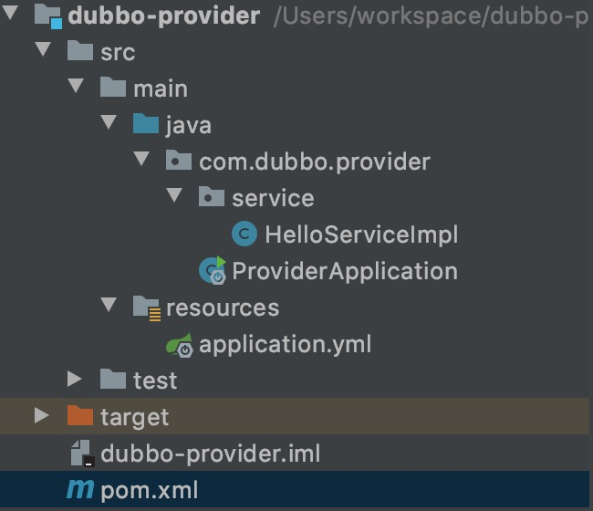
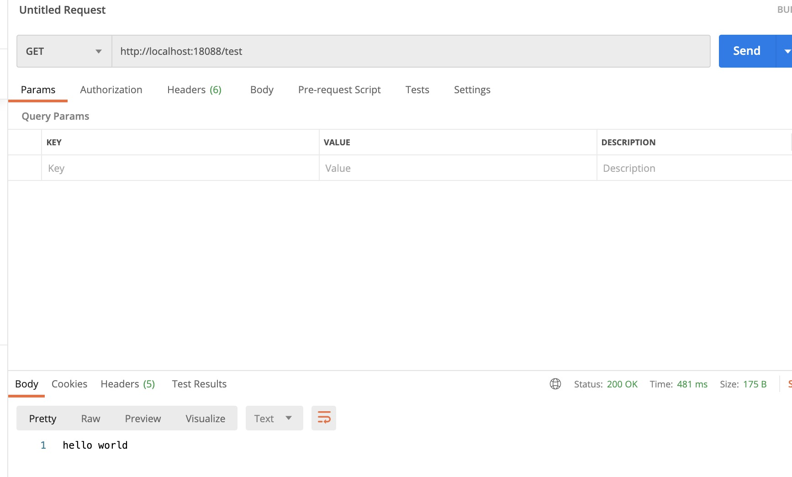

# 简易整合Dubbo

## 介绍
Apache Dubbo 是一款高性能、轻量级的开源Java RPC框架，它提供了三大核心能力：面向接口的远程方法调用，智能容错和负载均衡，以及服务自动注册和发现。本篇会简单做一个 Spring Boot 与 Dubbo 的整合，教你如何在 Spring Boot 中简单使用 Dubbo。

## 示例

1. [安装 zookeeper](https://segmentfault.com/a/1190000022287477)，用于 dubbo 服务注册

2. Dubbo 核心模块分别是**服务声明模块**，**服务提供模块**与**服务消费模块**。依据三个模块，先创建一个空的项目，然后向其中分别添加三个 Module，分别命名为 **dubbo-api**，**dubbo-provider**，**dubbo-consumer**。


3. 在 dubbo-api 模块中声明提供的接口

  * pom.xml **无需特别引入依赖**
    ```XML
    <?xml version="1.0" encoding="UTF-8"?>
    <project xmlns="http://maven.apache.org/POM/4.0.0"
            xmlns:xsi="http://www.w3.org/2001/XMLSchema-instance"
            xsi:schemaLocation="http://maven.apache.org/POM/4.0.0 http://maven.apache.org/xsd/maven-4.0.0.xsd">
        <modelVersion>4.0.0</modelVersion>

        <parent>
            <groupId>org.springframework.boot</groupId>
            <artifactId>spring-boot-starter-parent</artifactId>
            <version>2.3.3.RELEASE</version>
            <relativePath/> <!-- lookup parent from repository -->
        </parent>
        <groupId>org.dubbo</groupId>
        <artifactId>dubbo-api</artifactId>
        <version>1.0-SNAPSHOT</version>


        <build>
            <plugins>
                <plugin>
                    <groupId>org.springframework.boot</groupId>
                    <artifactId>spring-boot-maven-plugin</artifactId>
                </plugin>
            </plugins>
        </build>
    </project>
    ```

  * HelloService 声明接口
    ```JAVA
    // Service
    package com.dubbo.demo;

    public interface HelloService {

        String HelloWorld();
    }
    ```
  
  * 目录结构图

  

4. 在 dubbo-provider 中实现服务接口，提供服务

  * ProviderApplication 用于启动服务，提供服务
  ```JAVA
  package com.dubbo.provider;

  import org.springframework.boot.SpringApplication;
  import org.springframework.boot.autoconfigure.SpringBootApplication;

  @SpringBootApplication
  public class ProviderApplication {

      public static void main(String[] args){
          SpringApplication.run(ProviderApplication.class, args);
      }
  }
  ```

  * pom.xml 引入 zookeeper、curator-recipes、dubbo-spring-boot-starter 与 dubbo-api
  ```XML
  <?xml version="1.0" encoding="UTF-8"?>
  <project xmlns="http://maven.apache.org/POM/4.0.0"
          xmlns:xsi="http://www.w3.org/2001/XMLSchema-instance"
          xsi:schemaLocation="http://maven.apache.org/POM/4.0.0 http://maven.apache.org/xsd/maven-4.0.0.xsd">
      <modelVersion>4.0.0</modelVersion>

      <parent>
          <groupId>org.springframework.boot</groupId>
          <artifactId>spring-boot-starter-parent</artifactId>
          <version>2.3.3.RELEASE</version>
          <relativePath/> <!-- lookup parent from repository -->
      </parent>
      <groupId>org.dubbo</groupId>
      <artifactId>dubbo-provider</artifactId>
      <version>1.0-SNAPSHOT</version>

      <dependencies>
          <dependency>
              <groupId>org.springframework.boot</groupId>
              <artifactId>spring-boot-starter-web</artifactId>
          </dependency>
          <!-- Zookeeper -->
          <dependency>
              <groupId>org.apache.zookeeper</groupId>
              <artifactId>zookeeper</artifactId>
              <version>3.6.1</version>
          </dependency>
          <dependency>
              <groupId>org.apache.curator</groupId>
              <artifactId>curator-recipes</artifactId>
              <version>5.1.0</version>
              <exclusions>
                  <exclusion>
                      <groupId>org.apache.zookeeper</groupId>
                      <artifactId>zookeeper</artifactId>
                  </exclusion>
              </exclusions>
          </dependency>

          <!-- 最新 starter -->
          <dependency>
              <groupId>org.apache.dubbo</groupId>
              <artifactId>dubbo-spring-boot-starter</artifactId>
              <version>2.7.8</version>
          </dependency>

          <!-- 引入 dubbo-api -->
          <dependency>
              <groupId>org.dubbo</groupId>
              <artifactId>dubbo-api</artifactId>
              <version>1.0-SNAPSHOT</version>
              <scope>compile</scope>
          </dependency>
      </dependencies>

      <build>
          <plugins>
              <plugin>
                  <groupId>org.springframework.boot</groupId>
                  <artifactId>spring-boot-maven-plugin</artifactId>
              </plugin>
          </plugins>
      </build>
  </project>
  ```

  * application.yml 配置 zookeeper 地址，dubbo 服务端口与服务所在包
  ```YAML
  server:
  port: 10020
  dubbo:
    application:
      name: dubbo-provider
    registry:
      address: zookeeper://127.0.0.1:2181
      timeout: 15000

    protocol:
      name: dubbo
      port: 20880
    scan:
      base-packages: com.dubbo.provider.service
  ```

  * HelloServiceImpl 实现接口
  ```JAVA
  package com.dubbo.provider.service;

  import org.apache.dubbo.config.annotation.DubboService;
  import com.dubbo.demo.HelloService;

  @DubboService
  public class HelloServiceImpl implements HelloService {

      @Override
      public String HelloWorld() {
          return "hello world";
      }
  }
  ```
  
  * 目录结构图

  

5. 在 dubbo-consumer 中消费服务

  > ConsumerApplication、pom.xml 与 Provider 相似

  * application.yml
  ```YAML
  server:
  port: 18088

  dubbo:
    application:
      name: dubbo-consumer
    registry:
      address: zookeeper://127.0.0.1:2181
      protocol: zookeeper
      timeout: 15000
    protocol:
      name: dubbo
      port: 20880
  ```

  * TestController
  ```JAVA
  package com.dubbo.consumer.controller;

  import org.apache.dubbo.config.annotation.DubboReference;
  import com.dubbo.demo.HelloService;
  import org.springframework.web.bind.annotation.GetMapping;
  import org.springframework.web.bind.annotation.RestController;

  @RestController
  public class TestController {

      @DubboReference
      HelloService helloService;

      @GetMapping("/test")
      public String test() {
          return helloService.HelloWorld();
      }
  }
  ```
  
  * 目录结构图

  

6. 测试结果

  


# 参考资料
1. [mac zookeeper安装使用](https://segmentfault.com/a/1190000022287477)