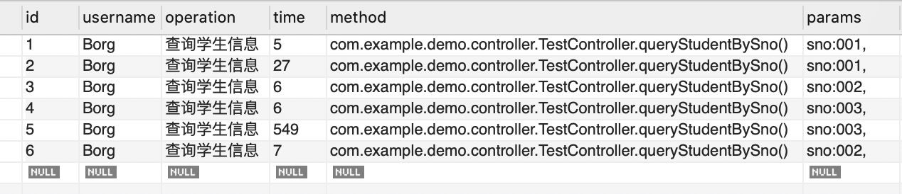

# AOP实现超简易的操作日志记录

## 介绍
业务中我们经常需要记录用户的操作日志，用于查询用户的一些历史操作记录，排查生产问题。AOP全称面向切面编程，即将方法看成一个切面，可以在切面的前后分别做一些前置或后置操作，非常适合应用于一些普遍的公共行为操作。而日志也是一种公共的行为，针对不同的行为，都有相同的记录日志行为，因此适合使用AOP来实现日志的记录。

## 实现

1. 创建操作日志对象实体类
```JAVA
@Data
public class SysLog implements Serializable {

    private static final long serialVersionUID = 6182609441457492732L;

    private Integer id;
    private String username;
    private String operation;
    private Integer time;
    private String method;
    private String params;
    private String ip;
    private LocalDateTime createTime;
}
```

2. 数据库建表
```SQL
CREATE TABLE test.syslog (
   id int auto_increment primary key NOT NULL ,
   username varchar(50) NULL ,
   operation varchar(50) NULL ,
   time int NULL ,
   method varchar(200) NULL ,
   params varchar(500) NULL ,
   ip varchar(64) NULL ,
   created_time DATE NULL
);
```

3. dao层实现
```JAVA
@Component
@Mapper
public interface SysLogDao {

    @Insert("insert into test.syslog(username,operation,time,method,params,ip,created_time) " +
            "values(#{username},#{operation},#{time},#{method},#{params},#{ip},#{createTime})")
    int add(SysLog sysLog);

    @Select("select * from test.syslog where username=#{username}")
    @Results(id = "sysLog",value= {
            @Result(property = "username", column = "username", javaType = String.class),
            @Result(property = "operation", column = "operation", javaType = String.class),
            @Result(property = "time", column = "time", javaType = Integer.class),
            @Result(property = "method", column = "method", javaType = String.class),
            @Result(property = "params", column = "params", javaType = String.class),
            @Result(property = "ip", column = "ip", javaType = String.class),
            @Result(property = "createTime", column = "created_time", javaType = LocalDateTime.class)
    })
    List<SysLog> querySyslogByUsername(String username);
}
```

4. 实现日志注解
```JAVA
// 注解应用于方法上，作用于运行时
@Target(ElementType.METHOD)
@Retention(RetentionPolicy.RUNTIME)
public @interface Log {
    // 用于存储操作日志行为描述
    String value() default "";
}
```

5. 实现具体切面
```JAVA
@Aspect
@Component
public class LogAspect {

    @Autowired
    private SysLogDao sysLogDao;

    // 定义切点，指定切点为Log注解
    @Pointcut("@annotation(com.example.demo.annotation.Log)")
    public void pointcut() {}

    // 定义环绕在切点前后的操作
    @Around("pointcut()")
    public Object doAround(ProceedingJoinPoint point) {
        Object result = null;
        // 记录起始时间
        long start = System.currentTimeMillis();

        try {
            // 调用方法，完成具体逻辑
            result = point.proceed();
        } catch (Throwable e) {
            e.printStackTrace();
        }

        // 计算方法执行时间差
        long time = System.currentTimeMillis() - start;
        // 保存操作日志
        saveLog(point, time);

        return result;
    }

    private void saveLog(ProceedingJoinPoint point, long time) {
        SysLog sysLog = new SysLog();
        // 设置用户名
        sysLog.setUsername("Borg");

        // 从切点获取方法签名
        MethodSignature signature = (MethodSignature) point.getSignature();
        // 获取方法
        Method method = signature.getMethod();
        // 获取日志注解
        Log annotation = method.getAnnotation(Log.class);

        // 获取日志注解上的描述，并且设置日志行为描述
        if (annotation != null) {
            sysLog.setOperation(annotation.value());
        }

        // 获取类名
        String className = point.getTarget().getClass().getName();
        // 获取方法名
        String methodName = method.getName();
        // 设置方法全名
        sysLog.setMethod(className + "." + methodName + "()");

        // 获取参数
        Object[] args = point.getArgs();
        // 读取参数名
        LocalVariableTableParameterNameDiscoverer l = new LocalVariableTableParameterNameDiscoverer();
        String[] paramNames = l.getParameterNames(method);
        // 设置参数
        if (args != null && paramNames != null) {
            StringBuilder params = new StringBuilder();
            for (int i = 0; i < paramNames.length; i++) {
                params.append(paramNames[i]);
                params.append(":");
                params.append(args[i].toString());
                params.append(", ");
            }
            sysLog.setParams(params.toString());
        }

        // 设置时间
        sysLog.setTime((int) time);
        sysLog.setCreateTime(LocalDateTime.now());

        sysLogDao.add(sysLog);
    }
}
```

6. 在方法上应用注解，记录操作
```JAVA
@RestController
public class TestController {

    @Autowired
    private StudentService studentService;

    @Log("查询学生信息")
    @RequestMapping( value = "/querystudent", method = RequestMethod.GET)
    public Student queryStudentBySno(String sno) {
        return this.studentService.queryStudentBySno(sno);
    }
}
```

记录结果如下：


## 总结
使用AOP实现操作日志非常的简便，在需要记录的地方只需要简单的使用注解即可轻松记录下用户的操作。实现也不会很麻烦，核心点在于切面类的实现，需要选好切点，然后做具体实现即可，利用好AOP编程可以帮我们非常简便优雅的做很多操作，是一把利器。

## END
**Author**: Borg

**Time**: Mon Jul 06 2020 19:10:27 GMT+0800 (中国标准时间)