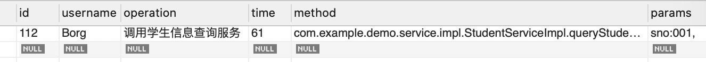
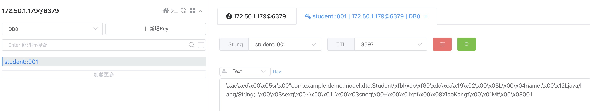

# 整合Redis缓存

## 介绍
缓存在我们业务中基本上属于必会的技能之一了，在业务中使用缓存的场景非常常见。因为缓存可以很好的帮助我们缓冲数据库的压力，利用好缓存可以让整个系统的并发能力大大提高，所以这篇文章简单介绍下Spring如何整合Redis缓存，并且使用Spring Cache中的注解简化我们的缓存操作。

## 实现
1. 引入redis相关依赖
```XML
<dependency>
    <groupId>org.springframework.boot</groupId>
    <artifactId>spring-boot-starter-data-redis</artifactId>
</dependency>
```

------------------------------------------------------------------------------------

2. 在application.yml文件中添加redis相关配置
```YAML
srping:
  # redis数据库配置
  redis:
    # Redis数据库索引（默认为0）
    database: 0
    # Redis服务器地址
    host: 127.0.0.1
    # Redis服务器连接端口
    port: 6379
    # 连接超时时间（毫秒）
    timeout: 1000
    password: 123456
    pool:
      # 连接池最大连接数（使用负值表示没有限制）
      max-active: 5
      # 连接池最大阻塞等待时间（使用负值表示没有限制）
      max-wait: -1
      # 连接池中的最大空闲连接
      max-idle: 5
      # 连接池中的最小空闲连接
      min-idle: 0
```

------------------------------------------------------------------------------------

3. 添加Redis配置类，基于Spring Boot 2.X
```JAVA
@Configuration
@EnableCaching // 要开启必须要加上`@EnableCaching`注解，不添加的话不会开启缓存，也可以添加在启动类上
public class RedisConfig extends CachingConfigurerSupport {

    private static final String SYMBOL_COLON = ":";

    // 配置类可以添加自定义的缓存key生成规则，只要如下实现即可，同时还可以定义多个KeyGenerator，针对不同的缓存名使用不同的生成规则，此处不作讲解
//    @Override
//    @Bean
//    public KeyGenerator keyGenerator() {
//        return (target, method, params) -> {
//            StringBuffer sb = new StringBuffer();
////            sb.append(target.getClass().getName());
////            sb.append(SYMBOL_COLON);
//            sb.append(method.getName());
//            sb.append(SYMBOL_COLON);
//            for (Object obj : params) {
//                sb.append(obj.toString());
//            }
//            return sb.toString();
//        };
//    }

    // 自定义redis操作对象
    @Bean
    public RedisTemplate redisTemplate(RedisConnectionFactory connectionFactory) {
        StringRedisTemplate redisTemplate = new StringRedisTemplate(connectionFactory);

        // 设置序列化工具，也可以不指定，默认存储的也是序列化以后的JSON，取出的时候也不需要自己去解析JSON，自动转化为POJO类
        Jackson2JsonRedisSerializer jackson2JsonRedisSerializer = new Jackson2JsonRedisSerializer<>(Object.class);
        ObjectMapper om = new ObjectMapper();
        om.setVisibility(PropertyAccessor.ALL, JsonAutoDetect.Visibility.ANY);
        om.activateDefaultTyping(LaissezFaireSubTypeValidator.instance,
            ObjectMapper.DefaultTyping.NON_FINAL,
            JsonTypeInfo.As.WRAPPER_ARRAY);
        jackson2JsonRedisSerializer.setObjectMapper(om);

        redisTemplate.setValueSerializer(jackson2JsonRedisSerializer);
        redisTemplate.afterPropertiesSet();
        return redisTemplate;
    }

    // 设置缓存配置，比如缓存时间
    @Bean
    public CacheManager cacheManager(RedisConnectionFactory redisConnectionFactory) {
        // 设置缓存有效期一小时
        RedisCacheConfiguration redisCacheConfiguration = RedisCacheConfiguration.defaultCacheConfig()
            .entryTtl(Duration.ofHours(1));
        return RedisCacheManager
                .builder(RedisCacheWriter.nonLockingRedisCacheWriter(redisConnectionFactory))
                .cacheDefaults(redisCacheConfiguration).build();
    }
}
```

------------------------------------------------------------------------------------

4. 在需要缓存的类上添加缓存注解
```JAVA
@CacheConfig(cacheNames = "student")
public interface StudentService {

    int add(Student student);

    @CachePut(key = "#student.sno")
    Student update(Student student);

    @CacheEvict(key = "#sno")
    int deleteBySno(String sno);

    @Cacheable(key = "#sno", unless = "#result == null")
    Student queryStudentBySno(String sno);
}
```
* `@CacheConfig`用于配置类中其他缓存配置的一些公共配置，比如类的默认缓存名称。也可以不使用改注解，在其他注解上自己单独配置。
* `@Cacheable`用于表示调用该注解标识的方法时，会先去查询缓存，如果有则直接返回缓存，没有的话则调用方法，缓存方法的返回结果，可配置的主要参数有：
  
  **value、cacheNames**：这两个参数意思等同，就是配置指定的缓存名称。
  
  **key**：用于配置缓存的key值，实际最终的key值会是*[缓存名称]::[key]*。key配置的规则使用的是SpEL表达式来表示，比如`@Cacheable(key = "#p0")`，`#p0`的意思是去第一个参数。
  
  **condition**：配置是否缓存的条件，比如：`@Cacheable(key = "#p0", condition = "#p0.length() < 3")`。
  
  **unless**：这个不同于condition，它的调用时机是在方法调用完以后，可以获取到方法的结果来进行判断，比如：`@Cacheable(key = "#sno", unless = "#result == null")`,表示的是只有当结果不为null的时候才会被缓存，和我想的也不一样，我本来认为这样表示的为null的时候才缓存，实际测试结果刚好相反。
  
  **keyGenerator**：用于指定key生成器，非必需。若需要指定一个自定义的key生成器，我们需要去实现org.springframework.cache.interceptor.KeyGenerator接口，并使用该参数来指定。
  
  **cacheManager**：用于指定使用哪个缓存管理器，非必需。只有当有多个时才需要使用。
  
  **cacheResolver**：用于指定使用那个缓存解析器，非必需。需通过org.springframework.cache.interceptor.CacheResolver接口来实现自己的缓存解析器，并用该参数指定。
* `@CachePut`参数与`@Cacheable`都一样，区别在于`@CachePut`标识的方法一定是会被调用的，而且返回的结果会用于更新缓存，使用来更新缓存的。
* `@CacheEvict`是用来标识需要删除缓存的方法，该注解会删除指定的缓存。它除了上面的参数以外还有2个额外的参数：
  
  **allEntries**：非必需，默认为false。当为true时，会移除所有数据。
  
  **beforeInvocation**：非必需，默认为false，会在调用方法之后移除数据。当为true时，会在调用方法之前移除数据。

------------------------------------------------------------------------------------

5. 如上处理好了以后就可以开始测试了
测试前数据库数据：

测试代码：
1. 测试查询2次
```JAVA
@Test
void contextLoads() {
    // 首次查询001，直接查询数据库，并添加缓存
    Student student1 = studentService.queryStudentBySno("001");
    Assert.notNull(student1, "不为空");
    // 第二次查询001，缓存中存在，查询缓存，不查询数据库
    Student student2 = studentService.queryStudentBySno("001");
    Assert.notNull(student2, "不为空");
}
```
结果：测试通过，数据库访问记录只有1条查询记录，缓存有1条。

MySQL：

Redis：


2. 测试更新数据同时更新缓存
```JAVA
@Test
void contextLoads() {
    // 首次查询001，直接查询数据库，并添加缓存
    Student student1 = studentService.queryStudentBySno("001");
    Assert.notNull(student1, "不为空");
    // 第二次查询001，缓存中存在，查询缓存，不查询数据库
    Student student2 = studentService.queryStudentBySno("001");
    Assert.notNull(student2, "不为空");
    Assert.isTrue(student2.getName().equals("KangKang"), "名称等于KangKang");
    // 更新001，同步更新缓存
    Student student3 = Student.builder().sno("001").name("XiaoKang").sex("M").build();
    studentService.update(student3);
    // 第三次查询缓存，缓存已更新
    Student student4 = studentService.queryStudentBySno("001");
    Assert.isTrue(student4.getName().equals("XiaoKang"), "名称等于XiaoKang");
}
```
结果：测试通过，数据库访问记录有2条，一条查询记录一条更新记录。缓存有1条，内容为已更新内容。

MySQL：

Redis：


3. 测试新增数据并删除，缓存也删除
```JAVA
@Test
void contextLoads() {
    // 添加新的数据
    Student student5 = Student.builder().sno("004").name("Borg").sex("M").build();
    studentService.add(student5);
    // 首次查询004，查询数据库，添加进缓存
    Student student6 = studentService.queryStudentBySno("004");
    Assert.notNull(student6, "不为空");
    // 第二次查询004，查询缓存
    Student student7 = studentService.queryStudentBySno("004");
    Assert.notNull(student7, "不为空");
    // 删除缓存
    studentService.deleteBySno("004");
    // 第三次查询004，缓存中不存在，查询数据库，结果为null，不添加进缓存
    Student student8 = studentService.queryStudentBySno("004");
    Assert.isNull(student8, "为空");
}
```
结果：测试通过，数据库访问记录有3条，两条查询记录，一条删除记录。缓存0条，被删除且最终null值不缓存。

MySQL：

Redis：


## 总结
Spring整合Redis的关键点在于实现好Redis配置类，在配置类中可以做一些自定义的配置。在实际业务中，需要准确的选择好需要缓存的服务和缓存时间，缓存的条件也是关键，配合上注解，可以很容易的处理好缓存。缓存是一门可以深耕的内容，在生产中缓存的场景往往会复杂很多，我们还需要应对很多缓存的问题，比如缓存雪崩，缓存穿透等，这些以后再抽单独的篇章来讲解，学好缓存是后端的必修课。

在实现的过程中还碰到一个问题，就是使用`@CachePut`注解的时候，方法的返回值得准确，注解会使用方法的返回值更新缓存。我开始更新方法返回的是更新的条数，Integer类型，然后在查询的时候反序列化过程直接抛出`java.lang.ClassCastException`，反序列化失败。在更新方法中返回更新以后查询的新值就好了，这点需要注意下。

## 参考资料
1. [SpEL表达式](https://docs.spring.io/spring/docs/current/spring-framework-reference/integration.html#cache)
2. [Spring Boot Redis](https://docs.spring.io/spring-boot/docs/current/reference/html/common-application-properties.html#REDIS)
3. [参考文章](https://mrbird.cc/Spring-Boot%20cache.html)

<!-- ## END
**作者**: Borg

**创建时间**: 2020-07-09 09:19 周四

**最后更新时间**: 2020-07-09 09:19 周四 -->