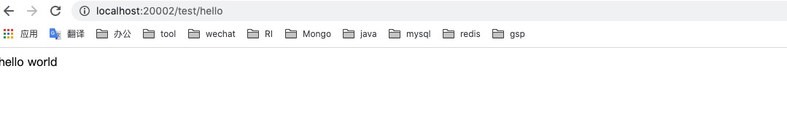

# 使用 Spring Security 简单搭建表单登录

## 1. 开启 Spring Security
开始 Spring Security 非常简单，只需要你在项目中引入了依赖，项目会默认如下配置来开启认证：

```YAML
security:
  basic:
    enabled: true
```

所以只需引入如下依赖即可开启 Spring Security：

```XML
<dependency>
    <groupId>org.springframework.boot</groupId>
    <artifactId>spring-boot-starter-security</artifactId>
</dependency>
```

## 2. 添加 Controller
接下来我们添加一个测试用的 HelloWorld 控制器：

```JAVA
package com.example.security.controller;

import org.springframework.web.bind.annotation.GetMapping;
import org.springframework.web.bind.annotation.RequestMapping;
import org.springframework.web.bind.annotation.RestController;

@RestController
@RequestMapping("/test")
public class HelloWorld {

    @GetMapping("/hello")
    public String hello() {
        return "hello world";
    }
}
```

## 3. 运行项目，使用自带表单登录
完成以上两个步骤，即可尝试调用我们的 hello 接口，来触发自带的登录表单，登录调用接口了。

项目启动以后，在 Console 中会输出我们的默认密码，账户名默认为 **user**，如下：


然后在浏览器请求 **/test/hello** 会自动跳转到默认表单页面:


输入默认用户名与密码即可登录访问接口：


接口请求成功：




## 总结
好了，最简单的表单登录已经成功了，已经最简单的使用了 Spring Security 框架，接下来将继续深入。