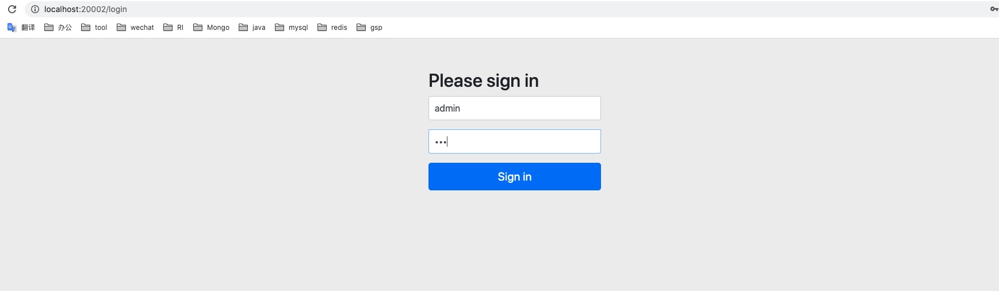
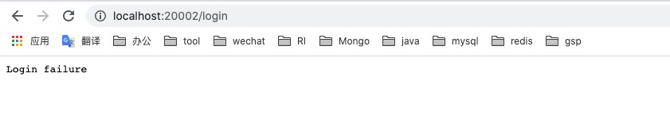

# 自定义用户认证
之前我们介绍了如何使用默认的表单用户认证来登录调用接口，接下来我们将学习如何使用自定的用户来登录。

## 1. 添加 Security 配置类
在实现自定义用户认证之前，我们首先需要提前在配置中指定密码加密器，如下：

```JAVA
package com.example.security.config;

import org.springframework.context.annotation.Bean;
import org.springframework.context.annotation.Configuration;
import org.springframework.security.config.annotation.authentication.builders.AuthenticationManagerBuilder;
import org.springframework.security.config.annotation.web.builders.HttpSecurity;
import org.springframework.security.config.annotation.web.configuration.WebSecurityConfigurerAdapter;
import org.springframework.security.crypto.bcrypt.BCryptPasswordEncoder;
import org.springframework.security.crypto.password.PasswordEncoder;

@Configuration
public class SecurityConfig extends WebSecurityConfigurerAdapter {

    /**
     * 使用 Spring Security 自带的密码加密器
     */
    @Bean
    public PasswordEncoder passwordEncoder() {
        return new BCryptPasswordEncoder();
    }
}
```

## 2. 实现 UserDetailService 接口
Spring Security 提供了一个 **UserDetailService** 接口，实现该接口中的 **loadUserByUsername** 方法，返回你指定的用户信息即可，代码如下:

```JAVA
package com.example.security.service;

import org.springframework.beans.factory.annotation.Autowired;
import org.springframework.security.core.userdetails.User;
import org.springframework.security.core.userdetails.UserDetails;
import org.springframework.security.core.userdetails.UserDetailsService;
import org.springframework.security.core.userdetails.UsernameNotFoundException;
import org.springframework.security.crypto.password.PasswordEncoder;
import org.springframework.stereotype.Component;

@Component
public class UserDetailServiceImpl implements UserDetailsService {

    @Autowired
    PasswordEncoder passwordEncoder;

    @Override
    public UserDetails loadUserByUsername(String username) throws UsernameNotFoundException {
        // 这里我默认填写了一个用户，实际中你可以使用参数 username 查询数据库，获取真实用户信息来返回
        return User.builder().username("admin").password("123").disabled(false)
                .accountExpired(false).credentialsExpired(false).accountLocked(false).authorities("admin").build();
    }
}

```

## 3. 测试用户登录
好了，完成以上步骤你就可以启动项目来尝试登录了。




## 4. 添加登录成功/失败处理器，返回登录结果
我们在登录以后往往需要返回登录成功或失败的信息来告诉用户，接下来我们将配置登录成功/失败处理器。

> 登录成功处理器
```JAVA
package com.example.security.handler;

import org.springframework.security.core.Authentication;
import org.springframework.security.web.authentication.AuthenticationSuccessHandler;
import org.springframework.stereotype.Component;

import javax.servlet.ServletException;
import javax.servlet.http.HttpServletRequest;
import javax.servlet.http.HttpServletResponse;
import java.io.IOException;

@Component
public class LoginSuccessHandler implements AuthenticationSuccessHandler {

    @Override
    public void onAuthenticationSuccess(HttpServletRequest httpServletRequest, HttpServletResponse httpServletResponse,
                                        Authentication authentication) throws IOException, ServletException {

        httpServletResponse.getWriter().write("Login success");
    }
}
```

> 登录失败处理器
```JAVA
package com.example.security.handler;

import org.springframework.security.core.AuthenticationException;
import org.springframework.security.web.authentication.AuthenticationFailureHandler;
import org.springframework.stereotype.Component;

import javax.servlet.ServletException;
import javax.servlet.http.HttpServletRequest;
import javax.servlet.http.HttpServletResponse;
import java.io.IOException;

@Component
public class LoginFailureHandler implements AuthenticationFailureHandler {

    @Override
    public void onAuthenticationFailure(HttpServletRequest httpServletRequest, HttpServletResponse httpServletResponse,
                                        AuthenticationException e) throws IOException, ServletException {

        httpServletResponse.getWriter().write("Login failure");
    }
}
```

## 5. 修改安全认证配置，使登录成功/失败处理器生效
```JAVA
package com.example.security.config;
import com.example.security.handler.LoginFailureHandler;
import com.example.security.handler.LoginSuccessHandler;
import org.springframework.beans.factory.annotation.Autowired;
import org.springframework.context.annotation.Bean;
import org.springframework.context.annotation.Configuration;
import org.springframework.security.config.annotation.ObjectPostProcessor;
import org.springframework.security.config.annotation.authentication.builders.AuthenticationManagerBuilder;
import org.springframework.security.config.annotation.web.builders.HttpSecurity;
import org.springframework.security.config.annotation.web.configuration.WebSecurityConfigurerAdapter;
import org.springframework.security.crypto.bcrypt.BCryptPasswordEncoder;
import org.springframework.security.crypto.password.PasswordEncoder;
import org.springframework.security.web.access.intercept.FilterSecurityInterceptor;
import org.springframework.security.web.authentication.UsernamePasswordAuthenticationFilter;

@Configuration
public class SecurityConfig extends WebSecurityConfigurerAdapter {

    @Autowired
    LoginSuccessHandler successHandler;

    @Autowired
    LoginFailureHandler failureHandler;

    @Override
    protected void configure(HttpSecurity http) throws Exception {
        // 添加处理器
        http.formLogin()
                .successHandler(successHandler)
                .failureHandler(failureHandler);
    }

    /**
     * 使用 Spring Security 自带的密码加密器
     */
    @Bean
    public PasswordEncoder passwordEncoder() {
        return new BCryptPasswordEncoder();
    }
}
```

## 6. 登录测试
登录成功页面：


登录失败页面：



## 总结
自定义登录非常简单，只需要配置中指定密码加密器，然后实现 Spring Security 提供的 **UserDetailService** 接口即可。
配置登录成功/失败处理器在配置类中的 configure 方法中添加即可，configure 方法还可以做很多的配置，后面会一一介绍。