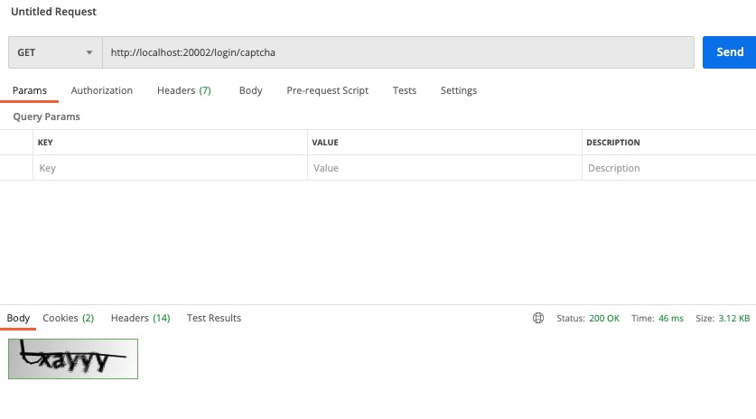
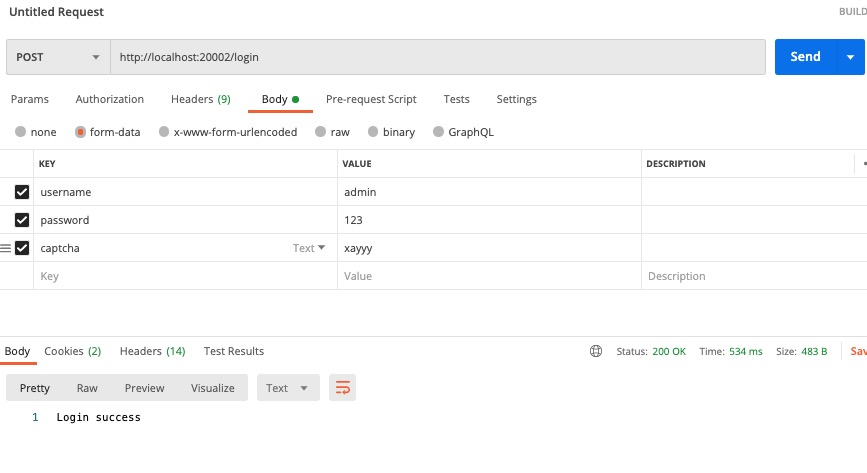

# 登录添加验证码
上篇简单介绍了如何开启自定义账户登录，这篇我们介绍下如何在登录流程中添加验证码，这里我们使用的生成验证码的包是 **kaptcha**。

## 1. 引入验证码相关依赖包
```XML
<!-- 用于生成验证码 -->
<dependency>
    <groupId>com.github.axet</groupId>
    <artifactId>kaptcha</artifactId>
    <version>0.0.9</version>
</dependency>
<!-- 用于在session中保存验证码 -->
<dependency>
    <groupId>org.springframework.social</groupId>
    <artifactId>spring-social-config</artifactId>
</dependency>
```

## 2. 添加验证码生成逻辑
> 验证码相关配置
```YAML
# 验证码配置
kaptcha:
  expired: 60
  border:
    enable: true
    color: "105,179,90"
  textproducer:
    font:
      color: "black"
      size: 30
      names: "宋体,楷体,黑体"
    char:
      length: 5
  image:
    width: 160
    height: 50
```

> 添加验证码生成配置类
```JAVA
package com.example.security.config;

import com.google.code.kaptcha.impl.DefaultKaptcha;
import com.google.code.kaptcha.util.Config;
import org.springframework.beans.factory.annotation.Value;
import org.springframework.context.annotation.Bean;
import org.springframework.context.annotation.Configuration;

import java.util.Properties;

@Configuration
public class KaptchaConfig {

    @Value("${kaptcha.border.enable}")
    private Boolean border;

    @Value("${kaptcha.border.color}")
    private String borderColor;

    @Value("${kaptcha.textproducer.font.color}")
    private String fontColor;

    @Value("${kaptcha.textproducer.font.size}")
    private String fontSize;

    @Value("${kaptcha.textproducer.font.names}")
    private String fontNames;

    @Value("${kaptcha.textproducer.char.length}")
    private String charLength;

    @Value("${kaptcha.image.width}")
    private String imageWidth;

    @Value("${kaptcha.image.height}")
    private String imageHeight;

    @Bean
    public DefaultKaptcha producer() {
        Properties properties = new Properties();
        // 设置边框
        if (border) {
            properties.put("kaptcha.border", "yes");
            // 设置边框颜色
            properties.put("kaptcha.border.color", borderColor);
        }
        // 设置字体颜色
        properties.put("kaptcha.textproducer.font.color", fontColor);
        //设置字体尺寸
        properties.put("kaptcha.textproducer.font.size", fontSize);
        // 设置验证码长度
        properties.put("kaptcha.textproducer.char.length", charLength);
        // 设置字体
        properties.put("kaptcha.textproducer.font.names", fontNames);
        // 设置图片宽度
        properties.put("kaptcha.image.width", imageWidth);
        // 设置图片高度
        properties.put("kaptcha.image.height", imageHeight);

        Config config = new Config(properties);
        DefaultKaptcha defaultKaptcha = new DefaultKaptcha();
        defaultKaptcha.setConfig(config);

        return defaultKaptcha;
    }
}
```

> 添加验证码对象类
```JAVA
package com.example.security.model;

import lombok.Data;

import java.awt.image.BufferedImage;
import java.io.Serializable;
import java.time.LocalDateTime;

@Data
public class Captcha implements Serializable {

    private static final long serialVersionUID = -2921955681067719313L;

    private static final int DEFAULT_EXPIRED = 60;

    /**
     * 有效时间，单位s
     */
    private Integer expireIn;

    /**
     * 验证码图片
     */
    private transient BufferedImage image;

    /**
     * 验证码代码
     */
    private String code;

    /**
     * 过期时间
     */
    private LocalDateTime expireTime;

    public Captcha(String code, BufferedImage image, Integer expireIn) {
        this.expireIn = expireIn == null ? DEFAULT_EXPIRED : expireIn;
        this.expireTime = LocalDateTime.now().plusSeconds(expireIn);
        this.code = code;
        this.image = image;
    }

    public Captcha(String code, BufferedImage image, LocalDateTime expireTime) {
        this.expireTime = expireTime == null ? LocalDateTime.now().plusSeconds(DEFAULT_EXPIRED) : expireTime;
        this.code = code;
        this.image = image;
    }

    public boolean isExpire() {
        return LocalDateTime.now().isAfter(this.expireTime);
    }
}
```

## 3. 添加自定义验证码校验异常类
```JAVA
package com.example.security.exception;

import org.springframework.security.core.AuthenticationException;

public class ValidateCaptchaException extends AuthenticationException {

    public ValidateCaptchaException(String message) {
        super(message);
    }
}
```

## 4. 添加登录控制器，并添加获取验证码接口
```JAVA
package com.example.security.controller;

import com.example.security.model.Captcha;
import com.google.code.kaptcha.Producer;
import org.springframework.beans.factory.annotation.Autowired;
import org.springframework.beans.factory.annotation.Value;
import org.springframework.web.bind.annotation.GetMapping;
import org.springframework.web.bind.annotation.RequestMapping;
import org.springframework.web.bind.annotation.RestController;

import javax.imageio.ImageIO;
import javax.servlet.http.HttpServletRequest;
import javax.servlet.http.HttpServletResponse;
import java.io.IOException;

@RestController
@RequestMapping("/login")
public class LoginController {

    @Value("${kaptcha.expired}")
    private Integer expired;

    private SessionStrategy sessionStrategy = new HttpSessionSessionStrategy();

    private static final String PICTURE_CONTENT_TYPE_JPEG = "image/jpeg";
    private static final String SESSION_KEY_CAPTCHA = "SESSION_KEY_CAPTCHA";

    @Autowired
    Producer producer;

    @GetMapping("/captcha")
    public void getCaptcha(HttpServletRequest request, HttpServletResponse response) throws IOException {
        String code = producer.createText();
        Captcha captcha = new Captcha(code, producer.createImage(code), expired);

        // 添加验证码至 session 中，用于校验时取出
        sessionStrategy.setAttribute(new ServletWebRequest(request), SESSION_KEY_CAPTCHA, captcha);

        response.setContentType(PICTURE_CONTENT_TYPE_JPEG);
        ImageIO.write(captcha.getImage(), PICTURE_CONTENT_TYPE_JPEG, response.getOutputStream());
    }
}
```

## 5. 添加验证码校验过滤器，用于校验登录接口请求中的验证码
```JAVA
package com.example.security.filter;

import com.example.security.model.Captcha;
import org.springframework.beans.factory.annotation.Autowired;
import org.springframework.security.web.authentication.AuthenticationFailureHandler;
import org.springframework.social.connect.web.HttpSessionSessionStrategy;
import org.springframework.social.connect.web.SessionStrategy;
import org.springframework.stereotype.Component;
import org.springframework.util.StringUtils;
import org.springframework.web.bind.ServletRequestBindingException;
import org.springframework.web.bind.ServletRequestUtils;
import org.springframework.web.context.request.ServletWebRequest;
import org.springframework.web.filter.OncePerRequestFilter;

import javax.servlet.FilterChain;
import javax.servlet.ServletException;
import javax.servlet.http.HttpServletRequest;
import javax.servlet.http.HttpServletResponse;
import java.io.IOException;

@Component
public class ValidateCaptchaFilter extends OncePerRequestFilter {

    @Autowired
    private AuthenticationFailureHandler authenticationFailureHandler;

    private SessionStrategy sessionStrategy = new HttpSessionSessionStrategy();

    /**
     * 静态字段可以添加至单独的静态字段文件中
     */
    private static final String LOGIN_PATH = "/login";
    private static final String POST_METHOD = "post";
    private static final String CAPTCHA_IS_EMPTY = "Captcha is empty";
    private static final String CAPTCHA_NOT_EXISTED = "Captcha not existed";
    private static final String CAPTCHA_IS_EXPIRED = "Captcha is expired";
    private static final String CAPTCHA_NOT_MATCHED = "Captcha not matched";
    private static final String CAPTCHA = "captcha";
    private static final String SESSION_KEY_CAPTCHA = "SESSION_KEY_CAPTCHA";

    @Override
    protected void doFilterInternal(HttpServletRequest httpServletRequest, HttpServletResponse httpServletResponse,
                                    FilterChain filterChain) throws ServletException, IOException {

        // 判断是否为请求登录接口，校验验证码
        if (LOGIN_PATH.equalsIgnoreCase(httpServletRequest.getRequestURI())
                && POST_METHOD.equalsIgnoreCase(httpServletRequest.getMethod())) {
            try {
                validateCode(new ServletWebRequest(httpServletRequest));
            } catch (Exception e) {
                // 校验失败，调用认证失败处理逻辑
                authenticationFailureHandler.onAuthenticationFailure(httpServletRequest, httpServletResponse, e);
                return;
            }
        }

        filterChain.doFilter(httpServletRequest, httpServletResponse);
    }

    private void validateCode(ServletWebRequest servletWebRequest) throws ServletRequestBindingException {
        // 获取 session 中的验证码
        Captcha codeInSession = (Captcha) sessionStrategy.getAttribute(servletWebRequest, SESSION_KEY_CAPTCHA);
        // 获取请求中的验证码
        String codeInRequest = ServletRequestUtils.getStringParameter(servletWebRequest.getRequest(), CAPTCHA);

        if (StringUtils.isEmpty(codeInRequest)) {
            throw new RuntimeException(CAPTCHA_IS_EMPTY);
        }
        if (codeInSession == null) {
            throw new RuntimeException(CAPTCHA_NOT_EXISTED);
        }
        if (codeInSession.isExpire()) {
            sessionStrategy.removeAttribute(servletWebRequest, SESSION_KEY_CAPTCHA);
            throw new RuntimeException(CAPTCHA_IS_EXPIRED);
        }
        if (!codeInSession.getCode().equalsIgnoreCase(codeInRequest)) {
            throw new RuntimeException(CAPTCHA_NOT_MATCHED);
        }

        sessionStrategy.removeAttribute(servletWebRequest, SESSION_KEY_CAPTCHA);
    }
}
```

## 6. 添加过滤器至 spring-security 配置中
```JAVA
package com.example.security.config;

import com.example.security.filter.ValidateCaptchaFilter;
import com.example.security.handler.LoginFailureHandler;
import com.example.security.handler.LoginSuccessHandler;
import org.springframework.beans.factory.annotation.Autowired;
import org.springframework.context.annotation.Bean;
import org.springframework.context.annotation.Configuration;
import org.springframework.security.config.annotation.web.builders.HttpSecurity;
import org.springframework.security.config.annotation.web.configuration.WebSecurityConfigurerAdapter;
import org.springframework.security.crypto.bcrypt.BCryptPasswordEncoder;
import org.springframework.security.crypto.password.PasswordEncoder;
import org.springframework.security.web.authentication.UsernamePasswordAuthenticationFilter;

@Configuration
public class SecurityConfig extends WebSecurityConfigurerAdapter {

    @Autowired
    LoginSuccessHandler successHandler;

    @Autowired
    LoginFailureHandler failureHandler;

    @Autowired
    ValidateCaptchaFilter validateCaptchaFilter;

    @Override
    protected void configure(HttpSecurity http) throws Exception {
        // 禁用CSRF 开启跨域
        http.cors().and().csrf().disable();

        http.formLogin()
                .successHandler(successHandler)
                .failureHandler(failureHandler);

        // 在用户名密码校验过滤器之前添加上验证码校验过滤器
        http.addFilterBefore(validateCaptchaFilter, UsernamePasswordAuthenticationFilter.class);
    }

    /**
     * 使用 Spring Security 自带的密码加密器
     */
    @Bean
    public PasswordEncoder passwordEncoder() {
        return new BCryptPasswordEncoder();
    }
}
```

## 7. 简单改造下登录失败处理器，返回验证码校验失败原因
```JAVA
package com.example.security.handler;

import org.springframework.security.core.AuthenticationException;
import org.springframework.security.web.authentication.AuthenticationFailureHandler;
import org.springframework.stereotype.Component;

import javax.servlet.ServletException;
import javax.servlet.http.HttpServletRequest;
import javax.servlet.http.HttpServletResponse;
import java.io.IOException;

@Component
public class LoginFailureHandler implements AuthenticationFailureHandler {

    @Override
    public void onAuthenticationFailure(HttpServletRequest httpServletRequest, HttpServletResponse httpServletResponse,
                                        AuthenticationException e) throws IOException, ServletException {

        if (e != null) {
            httpServletResponse.getWriter().write(e.getMessage());
        } else {
            httpServletResponse.getWriter().write("Login failure");
        }
    }
}
```


## 8. 测试
好了，准备工作就绪，接下来我们测试下验证码校验：

> 直接调用接口测试
1. 测试获取验证码


2. 测试登录成功


3. 测试未输入验证码


> 除了直接调用测试接口以外，我们还可以自己定义一个登录页，将获取验证码的地址集成到页面上，但是目前基本上都是前后端分离的架构，所以较为实用的还是直接调用接口，我这里就给出例子了


## 总结
以上就是如何在Spring Security中集成验证码校验逻辑的全过程了，过程非常简单，主要就是在获取验证码的时候将验证码写入 session 中，然后自定义验证码过滤器，并添加在验证账户密码的过滤器之前即可。