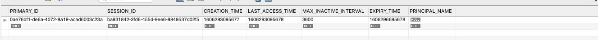
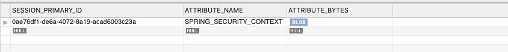

# 使用 Session 持久化登录态
之前我们介绍了如何自定义用户，自定义验证码等。处理完以上步骤之后，我们需要了解的就是用 Session 来持久化我们的登录态了，只有持久化了登录态，才能够确保在有多个服务的同时，也能够在不同的服务器中获取到用户的登录状态。

持久化登录态的方式有多种，接下来我们分别来介绍下如何使用 MySQL 和 Redis 来存储 Session。

## 使用 MySQL 存储登录态
1. 添加依赖至 pom.xml
```XML
<!-- MySQL 依赖 -->
<dependency>
    <groupId>mysql</groupId>
    <artifactId>mysql-connector-java</artifactId>
    <scope>runtime</scope>
</dependency>
<dependency>
    <groupId>org.springframework.boot</groupId>
    <artifactId>spring-boot-starter-jdbc</artifactId>
    <scope>runtime</scope>
</dependency>
<!-- Session 依赖 -->
<dependency>
    <groupId>org.springframework.session</groupId>
    <artifactId>spring-session-jdbc</artifactId>
</dependency>
```

2. 添加 MySQL 数据库连接配置与 Session 配置至 application.yml 文件中
```YAML
spring:
  # 数据库访问配置
  datasource:
    driver-class-name: com.mysql.cj.jdbc.Driver
    url: jdbc:mysql://localhost:3306/security
    username: root
    password: 123456
  # Session 配置
  session:
    # session 过期时间 单位s
    timeout: 3600
    # 存储 session 方式，这里选择为jdbc
    store-type: jdbc
```

3. 加入数据库 Session 存储表

> 在导入了 Session 的依赖并且添加好 Session 配置以后就已经开启了 Session 持久化了，但是在使用之前，我们还需要先在数据库中添加好我们 Session 相关的表，如下步骤。

```SQL
/* SPRING_SESSION 表，存储用户登录信息*/;
DROP TABLE IF EXISTS `SPRING_SESSION`;
CREATE TABLE `SPRING_SESSION` (
  `PRIMARY_ID` char(36) NOT NULL,
  `SESSION_ID` char(36) NOT NULL,
  `CREATION_TIME` bigint(20) NOT NULL,
  `LAST_ACCESS_TIME` bigint(20) NOT NULL,
  `MAX_INACTIVE_INTERVAL` int(11) NOT NULL,
  `EXPIRY_TIME` bigint(20) NOT NULL,
  `PRINCIPAL_NAME` varchar(100) DEFAULT NULL,
  PRIMARY KEY (`PRIMARY_ID`),
  UNIQUE KEY `SPRING_SESSION_IX1` (`SESSION_ID`),
  KEY `SPRING_SESSION_IX2` (`EXPIRY_TIME`),
  KEY `SPRING_SESSION_IX3` (`PRINCIPAL_NAME`)
) ENGINE=InnoDB DEFAULT CHARSET=utf8 ROW_FORMAT=DYNAMIC;

/* SPRING_SESSION_ATTRIBUTES 表，存储 Session 相关字段 */;
DROP TABLE IF EXISTS `SPRING_SESSION_ATTRIBUTES`;
CREATE TABLE `SPRING_SESSION_ATTRIBUTES` (
  `SESSION_PRIMARY_ID` char(36) NOT NULL,
  `ATTRIBUTE_NAME` varchar(200) NOT NULL,
  `ATTRIBUTE_BYTES` blob NOT NULL,
  PRIMARY KEY (`SESSION_PRIMARY_ID`,`ATTRIBUTE_NAME`),
  CONSTRAINT `SPRING_SESSION_ATTRIBUTES_FK` FOREIGN KEY (`SESSION_PRIMARY_ID`) REFERENCES `SPRING_SESSION` (`PRIMARY_ID`) ON DELETE CASCADE
) ENGINE=InnoDB DEFAULT CHARSET=utf8 ROW_FORMAT=DYNAMIC;
```

4. 改造原有验证码

> 添加完 SQL 表以后，我们的登录 Session 持久化就完成了，但是我们还需要改造下原有的验证码逻辑。原有的验证码使用的是 **spring-social-config** 包的本地 Session，在有多台服务器的时候，就会出现读取不到 Session 的情况，所以我们需要替换为当前新的 Session。

* 修改 LoginController
```JAVA
package com.example.security.controller;

import com.example.security.model.Captcha;
import com.google.code.kaptcha.Producer;
import org.springframework.beans.factory.annotation.Autowired;
import org.springframework.beans.factory.annotation.Value;
import org.springframework.web.bind.annotation.GetMapping;
import org.springframework.web.bind.annotation.RequestMapping;
import org.springframework.web.bind.annotation.RestController;

import javax.imageio.ImageIO;
import javax.servlet.http.HttpServletRequest;
import javax.servlet.http.HttpServletResponse;
import javax.servlet.http.HttpSession;
import java.io.IOException;

@RestController
@RequestMapping("/login")
public class LoginController {

    @Value("${kaptcha.expired}")
    private Integer expired;

    // 替换为 HttpSession
    // private SessionStrategy sessionStrategy = new HttpSessionSessionStrategy();
    @Autowired
    private HttpSession session;

    private static final String PICTURE_CONTENT_TYPE_JPEG = "image/jpeg";
    public static final String PICTURE_FORMAT_JPEG = "jpeg";
    private static final String SESSION_KEY_CAPTCHA = "SESSION_KEY_CAPTCHA";

    @Autowired
    Producer producer;

    @GetMapping("/captcha")
    public void getCaptcha(HttpServletRequest request, HttpServletResponse response) throws IOException {
        String code = producer.createText();
        Captcha captcha = new Captcha(code, producer.createImage(code), expired);

        // 替换为 HttpSession
        // sessionStrategy.setAttribute(new ServletWebRequest(request), SESSION_KEY_CAPTCHA, captcha);
        session.setAttribute(SESSION_KEY_CAPTCHA, captcha);

        response.setContentType(PICTURE_CONTENT_TYPE_JPEG);
        ImageIO.write(captcha.getImage(), PICTURE_FORMAT_JPEG, response.getOutputStream());
    }
}
```

* 修改 ValidateCaptchaFilter
```JAVA
package com.example.security.filter;

import com.example.security.exception.ValidateCaptchaException;
import com.example.security.model.Captcha;
import org.springframework.beans.factory.annotation.Autowired;
import org.springframework.security.web.authentication.AuthenticationFailureHandler;
import org.springframework.stereotype.Component;
import org.springframework.util.StringUtils;
import org.springframework.web.bind.ServletRequestBindingException;
import org.springframework.web.bind.ServletRequestUtils;
import org.springframework.web.context.request.ServletWebRequest;
import org.springframework.web.filter.OncePerRequestFilter;

import javax.servlet.FilterChain;
import javax.servlet.ServletException;
import javax.servlet.http.HttpServletRequest;
import javax.servlet.http.HttpServletResponse;
import javax.servlet.http.HttpSession;
import java.io.IOException;

@Component
public class ValidateCaptchaFilter extends OncePerRequestFilter {

    @Autowired
    private AuthenticationFailureHandler authenticationFailureHandler;

    // 替换为 HttpSession
    // private SessionStrategy sessionStrategy = new HttpSessionSessionStrategy();
    @Autowired
    private HttpSession session;

    /**
     * 静态字段可以添加至单独的静态字段文件中
     */
    private static final String LOGIN_PATH = "/login";
    private static final String POST_METHOD = "post";
    private static final String CAPTCHA_IS_EMPTY = "Captcha is empty";
    private static final String CAPTCHA_NOT_EXISTED = "Captcha not existed";
    private static final String CAPTCHA_IS_EXPIRED = "Captcha is expired";
    private static final String CAPTCHA_NOT_MATCHED = "Captcha not matched";
    private static final String CAPTCHA = "captcha";
    private static final String SESSION_KEY_CAPTCHA = "SESSION_KEY_CAPTCHA";

    @Override
    protected void doFilterInternal(HttpServletRequest httpServletRequest, HttpServletResponse httpServletResponse,
                                    FilterChain filterChain) throws ServletException, IOException {

        // 判断是否为请求登录接口，校验验证码
        if (LOGIN_PATH.equalsIgnoreCase(httpServletRequest.getRequestURI())
                && POST_METHOD.equalsIgnoreCase(httpServletRequest.getMethod())) {
            try {
                validateCode(new ServletWebRequest(httpServletRequest));
            } catch (ValidateCaptchaException e) {
                authenticationFailureHandler.onAuthenticationFailure(httpServletRequest, httpServletResponse, e);
                return;
            }
        }
        filterChain.doFilter(httpServletRequest, httpServletResponse);
    }
    private void validateCode(ServletWebRequest servletWebRequest) throws ServletRequestBindingException {
        // 替换为 HttpSession
        // Captcha codeInSession = (Captcha) sessionStrategy.getAttribute(servletWebRequest, SESSION_KEY_CAPTCHA);
        Captcha codeInSession = (Captcha) session.getAttribute(SESSION_KEY_CAPTCHA);

        String codeInRequest = ServletRequestUtils.getStringParameter(servletWebRequest.getRequest(), CAPTCHA);

        if (StringUtils.isEmpty(codeInRequest)) {
            throw new ValidateCaptchaException(CAPTCHA_IS_EMPTY);
        }
        if (codeInSession == null) {
            throw new ValidateCaptchaException(CAPTCHA_NOT_EXISTED);
        }
        if (codeInSession.isExpire()) {
            // 替换为 HttpSession
            // sessionStrategy.removeAttribute(servletWebRequest, SESSION_KEY_CAPTCHA);
            session.removeAttribute(SESSION_KEY_CAPTCHA);
            throw new ValidateCaptchaException(CAPTCHA_IS_EXPIRED);
        }
        if (!codeInSession.getCode().equalsIgnoreCase(codeInRequest)) {
            throw new ValidateCaptchaException(CAPTCHA_NOT_MATCHED);
        }

        // 替换为 HttpSession
        // sessionStrategy.removeAttribute(servletWebRequest, SESSION_KEY_CAPTCHA);
        session.removeAttribute(SESSION_KEY_CAPTCHA);
    }
}
```

5. 测试
> 好了，到现在已经完成了全部的工作，我们开始测试下

* 调用验证码接口
> 

* 查看数据库表情况
> SPRING_SESSION 表
> 
> SPRING_SESSION_ATTRIBUTES 表
> 

* 调用登录接口
> 

* 查看数据库表情况
> SPRING_SESSION 表
> 
> SPRING_SESSION_ATTRIBUTES 表
> 

> 从上面的结果可以看到，我们的验证码和登录态都会存储到数据库中了，这样当我们有多个服务的情况，也不影响用户登录态共享了，成功的持久化了我们的登录态到数据库中。


## 使用 Redis 存储登录态
其实使用 Redis 存储登录态与 MySQL 代码都是一样的，只是需要在将依赖修改为 Redis 连接，并且将配置修改为 Redis 即可。

1. 修改 Session 依赖为 Redis 依赖，并添加 Redis Stater
```XML
<!-- Session 依赖 -->
<dependency>
    <groupId>org.springframework.session</groupId>
    <artifactId>spring-session-data-redis</artifactId>
</dependency>
<!-- Redis 依赖 -->
<dependency>
    <groupId>org.springframework.boot</groupId>
    <artifactId>spring-boot-starter-data-redis</artifactId>
</dependency>
```

2. 修改配置
```YAML
spring:
  # Redis 数据库访问配置
  redis:
    # Redis数据库索引（默认为0）
    database: 0
    # Redis服务器地址
    host: 127.0.0.1
    # Redis服务器连接端口
    port: 6379
    # 连接超时时间（毫秒）
    timeout: 1000
    password: 123@456
    pool:
      # 连接池最大连接数（使用负值表示没有限制）
      max-active: 20
      # 连接池最大阻塞等待时间（使用负值表示没有限制）
      max-wait: -1
      # 连接池中的最大空闲连接
      max-idle: 5
      # 连接池中的最小空闲连接
      min-idle: 0

  # Session 配置
  session:
    timeout: 3600
    store-type: redis
```

3. 测试
> 修改完上面两部分就全部修改好了，代码我们是完全不需要动的，接下来我们测试下

* 调用验证码接口
> 

* 查看数据库情况
> Redis 情况
> 

* 调用登录接口
> 

* 查看数据库情况
> Redis 情况
> 