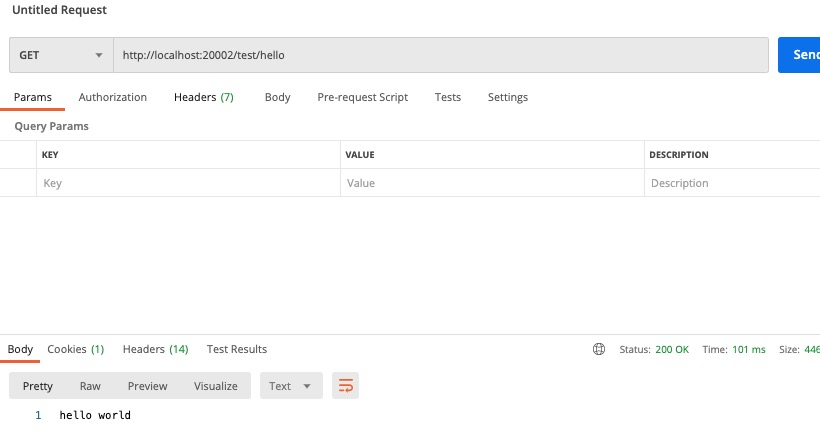
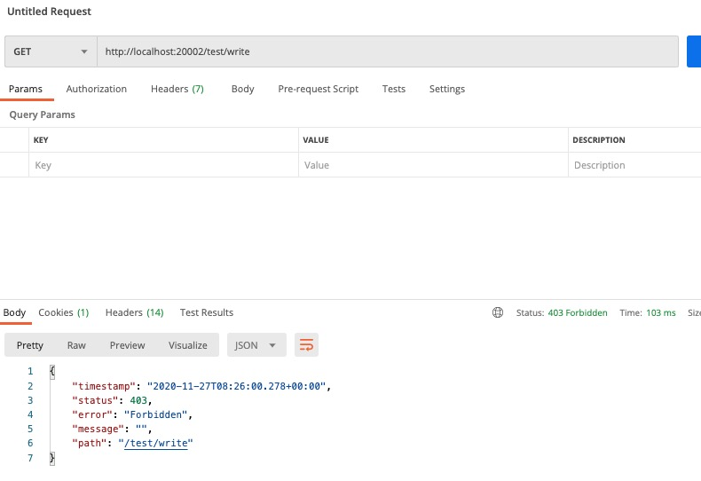
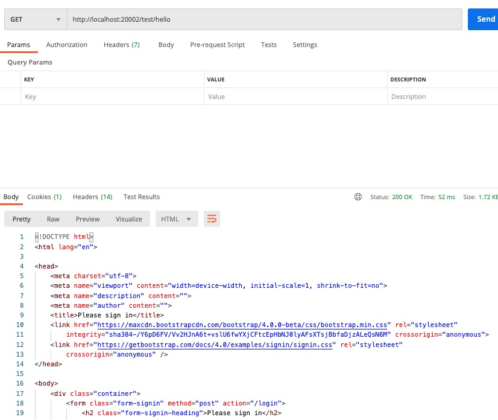
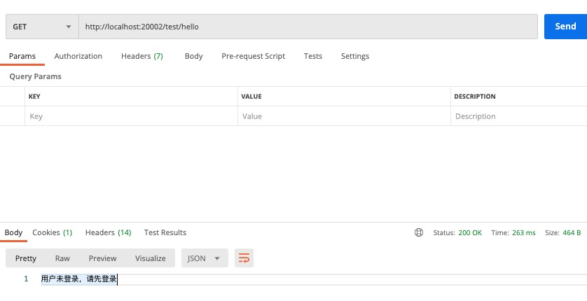

# 在 Spring Security 中添加权限控制
之前我们搭建了一个可以自己定义用户，包含验证码与持久化 Session 的登录模块，接下来我们开始再原有的基础上添加权限控制，让我们能够控制每一个接口的访问权限。

## 1. 添加 Mock 的权限 Map
> 添加一些 Mock 的权限数据，在你具体实现的时候，替换为数据库查询即可

```JAVA
package com.example.security.model;

import org.apache.logging.log4j.util.Strings;

import java.util.HashMap;
import java.util.Map;

public class Permission {

    public static final Map<String, String> users = new HashMap<String, String>() {{
        put("admin", "123");
        put("test", "123");
    }};

    public static final Map<String, String> userRoles = new HashMap<String, String>() {{
        put("adminRole", "admin");
        put("testRole", "test");
    }};

    public static final Map<String, String> rolePermissions = new HashMap<String, String>() {{
        put("queryPermission", "adminRole");
        put("writePermission", "testRole");
    }};

    public static final Map<String, String> permissionResources = new HashMap<String, String>() {{
        put("/test/hello", "queryPermission");
        put("/test/write", "writePermission");
    }};

    public static String getKeyByValue(Map<String, String> map, String value) {
        String matchedKey = Strings.EMPTY;

        for (String key : map.keySet()) {
            if (map.get(key).equals(value)) {
                matchedKey = key;
            }
        }

        return matchedKey;
    }
}
```

## 2. 添加权限获取来源处理器
> Spring Security 中提供了获取权限数据的接口，我们只需要实现接口 `FilterInvocationSecurityMetadataSource` 中的方法 `getAttributes()` 即可。

```JAVA
package com.example.security.handler;

import com.example.security.model.Permission;
import org.springframework.security.access.ConfigAttribute;
import org.springframework.security.access.SecurityConfig;
import org.springframework.security.web.FilterInvocation;
import org.springframework.security.web.access.intercept.FilterInvocationSecurityMetadataSource;
import org.springframework.stereotype.Component;
import org.springframework.util.StringUtils;

import java.util.ArrayList;
import java.util.Collection;
import java.util.List;

@Component
public class FilterInvocationSecurityMetadataSourceHandler implements FilterInvocationSecurityMetadataSource {

    @Override
    public Collection<ConfigAttribute> getAttributes(Object o) throws IllegalArgumentException {
        // 用于存储当前请求所需要的权限
        List<String> permissions = new ArrayList<>();

        //获取请求地址
        FilterInvocation invocation = (FilterInvocation) o;
        String requestUrl = invocation.getRequest().getRequestURI();

        // 模拟数据库，通过请求路径查询所需要的权限
        String resource = Permission.permissionResources.get(requestUrl);
        if (!StringUtils.isEmpty(resource)) {
            permissions.add(resource);
        }

        // 返回所需的权限
        return SecurityConfig.createList(permissions.toArray(new String[0]));
    }

    @Override
    public Collection<ConfigAttribute> getAllConfigAttributes() {
        return null;
    }

    @Override
    public boolean supports(Class<?> aClass) {
        return true;
    }
}
```

## 3. 添加权限校验的处理器
> 做完以上步骤我们即可依据请求的资源来查询到所需的权限，接下来我们需要做的则是通过获取到的权限数据来和我们拥有的权限做比较，判断权限是否匹配。

```JAVA
package com.example.security.handler;

import org.springframework.security.access.AccessDecisionManager;
import org.springframework.security.access.AccessDeniedException;
import org.springframework.security.access.ConfigAttribute;
import org.springframework.security.authentication.InsufficientAuthenticationException;
import org.springframework.security.core.Authentication;
import org.springframework.security.core.GrantedAuthority;
import org.springframework.stereotype.Component;

import java.util.Collection;
import java.util.Iterator;

@Component
public class AccessDecisionHandler implements AccessDecisionManager {

    @Override
    public void decide(Authentication authentication, Object o, Collection<ConfigAttribute> collection)
            throws AccessDeniedException, InsufficientAuthenticationException {

        Iterator<ConfigAttribute> iterator = collection.iterator();
        // 循环处理元数据处理器中返回的权限集合
        while (iterator.hasNext()) {
            // 获取当前请求需要的权限
            ConfigAttribute ca = iterator.next();
            String needRole = ca.getAttribute();

            // 从登陆认证信息中获取当前用户所具有的权限
            Collection<? extends GrantedAuthority> authorities = authentication.getAuthorities();

            // 判断拥有的权限中是否包含所需的权限，如果拥有任一所需的权限就表示拥有访问权
            for (GrantedAuthority authority : authorities) {
                if (authority.getAuthority().equals(needRole)) {
                    return;
                }
            }
        }

        throw new AccessDeniedException("权限不足!");
    }

    @Override
    public boolean supports(ConfigAttribute configAttribute) {
        return true;
    }

    @Override
    public boolean supports(Class<?> aClass) {
        return true;
    }
}
```

## 4. 修改用户登录时获取到的权限
> 所需的权限获取到了，权限比较的逻辑也有了，接下来我们就是要确保我们用户登录后获取到的用户本身的权限没问题了，我们需要修改的是 `UserdetailServiceImpl`。

```JAVA
package com.example.security.service;

import com.example.security.model.Permission;
import org.springframework.beans.factory.annotation.Autowired;
import org.springframework.security.core.userdetails.User;
import org.springframework.security.core.userdetails.UserDetails;
import org.springframework.security.core.userdetails.UserDetailsService;
import org.springframework.security.core.userdetails.UsernameNotFoundException;
import org.springframework.security.crypto.password.PasswordEncoder;
import org.springframework.stereotype.Component;

@Component
public class UserDetailServiceImpl implements UserDetailsService {

    @Autowired
    PasswordEncoder passwordEncoder;

    @Override
    public UserDetails loadUserByUsername(String username) throws UsernameNotFoundException {
        // 查询用户密码
        String pwd = Permission.users.get(username);

        // 查询 admin 用户的权限
        String role = Permission.getKeyByValue(Permission.userRoles, username);;
        String permission = Permission.getKeyByValue(Permission.rolePermissions, role);

        // 返回用户信息
        return User.builder().username(username).password(passwordEncoder.encode(pwd)).disabled(false)
                .accountExpired(false).credentialsExpired(false).accountLocked(false).authorities(permission).build();
    }
}
```

## 5. 修改 SecurityConfig 配置
> 下一步就是将我们添加的类都配置到 SecurityConfig 中，统一加入到认证流程中来处理。

```JAVA
package com.example.security.config;

import com.example.security.filter.ValidateCaptchaFilter;
import com.example.security.handler.AccessDecisionHandler;
import com.example.security.handler.FilterInvocationSecurityMetadataSourceHandler;
import com.example.security.handler.LoginFailureHandler;
import com.example.security.handler.LoginSuccessHandler;
import org.springframework.beans.factory.annotation.Autowired;
import org.springframework.context.annotation.Bean;
import org.springframework.context.annotation.Configuration;
import org.springframework.security.config.annotation.ObjectPostProcessor;
import org.springframework.security.config.annotation.web.builders.HttpSecurity;
import org.springframework.security.config.annotation.web.configuration.EnableWebSecurity;
import org.springframework.security.config.annotation.web.configuration.WebSecurityConfigurerAdapter;
import org.springframework.security.crypto.bcrypt.BCryptPasswordEncoder;
import org.springframework.security.crypto.password.PasswordEncoder;
import org.springframework.security.web.access.intercept.FilterSecurityInterceptor;
import org.springframework.security.web.authentication.UsernamePasswordAuthenticationFilter;

@Configuration
@EnableWebSecurity
public class SecurityConfig extends WebSecurityConfigurerAdapter {

    @Autowired
    LoginSuccessHandler successHandler;

    @Autowired
    LoginFailureHandler failureHandler;

    @Autowired
    ValidateCaptchaFilter validateCaptchaFilter;

    @Autowired
    FilterInvocationSecurityMetadataSourceHandler securityMetadataSourceHandler;

    @Autowired
    AccessDecisionHandler accessDecisionHandler;

    @Override
    protected void configure(HttpSecurity http) throws Exception {
        // 禁用CSRF 开启跨域
        http.cors().and().csrf().disable();

        http.authorizeRequests()
                // 通过 withObjectPostProcessor 将我们的两个处理器添加进入验证流程
                .withObjectPostProcessor(new ObjectPostProcessor<FilterSecurityInterceptor>() {
                    @Override
                    public <O extends FilterSecurityInterceptor> O postProcess(O o) {
                        // 决策管理器
                        o.setAccessDecisionManager(accessDecisionHandler);
                        // 权限数据源
                        o.setSecurityMetadataSource(securityMetadataSourceHandler);
                        return o;
                    }
                })
                // 配置验证码接口不需要校验
                .antMatchers("/login/captcha").permitAll()
                // 其他请求都需要校验
                .anyRequest().authenticated()
            // 配置登录接口信息
            .and()
                // 登录接口不需要校验
                .formLogin().permitAll()
                .successHandler(successHandler)
                .failureHandler(failureHandler);

        // 在用户名密码校验过滤器之前添加上验证码校验过滤器
        http.addFilterBefore(validateCaptchaFilter, UsernamePasswordAuthenticationFilter.class);
    }

    /**
     * 使用 Spring Security 自带的密码加密器
     */
    @Bean
    public PasswordEncoder passwordEncoder() {
        return new BCryptPasswordEncoder();
    }
}
```

## 6. 添加测试接口
```JAVA
package com.example.security.controller;

import org.springframework.web.bind.annotation.GetMapping;
import org.springframework.web.bind.annotation.RequestMapping;
import org.springframework.web.bind.annotation.RestController;

@RestController
@RequestMapping("/test")
public class HelloWorld {

    @GetMapping("/hello")
    public String hello() {
        return "hello world";
    }

    @GetMapping("/write")
    public String write() {
        return "test write";
    }
}
```

## 7. 测试
> 好了，完成以上步骤以后，接下来我们就可以开始测试了

* 登录 admin 用户


* 调用 hello 接口


* 调用 write 接口


* 登出后调用 hello 接口


> 测试结果中我们可以看到登录后 admin 用户调用 hello 接口成功，但是在调用 write 接口的时候，因为没有权限，所以调用失败了。当我们没有登录的时候去调用接口，也是会失败的。

## 8. 添加失败处理器
> 接下来我们再完善一下代码，添加失败的处理器，让我们调用失败后返回的内容符合我们的要求。

```JAVA
package com.example.security.handler;

import org.springframework.security.core.AuthenticationException;
import org.springframework.security.web.AuthenticationEntryPoint;

import javax.servlet.ServletException;
import javax.servlet.http.HttpServletRequest;
import javax.servlet.http.HttpServletResponse;
import java.io.IOException;

/**
 * 匿名未登录用户异常处理
 */
public class AuthenticationEntryPointExceptionHandler implements AuthenticationEntryPoint {

    @Override
    public void commence(HttpServletRequest httpServletRequest, HttpServletResponse httpServletResponse,
                         AuthenticationException e) throws IOException, ServletException {

        httpServletResponse.setContentType("text/json;charset=utf-8");
        httpServletResponse.getWriter().write("用户未登录，请先登录");
    }
}
```

```JAVA
package com.example.security.handler;

import org.springframework.security.access.AccessDeniedException;

import javax.servlet.ServletException;
import javax.servlet.http.HttpServletRequest;
import javax.servlet.http.HttpServletResponse;
import java.io.IOException;

/**
 * 权限拒绝处理器
 */
public class AccessDeniedHandler  implements org.springframework.security.web.access.AccessDeniedHandler {

    @Override
    public void handle(HttpServletRequest httpServletRequest, HttpServletResponse httpServletResponse,
                       AccessDeniedException e) throws IOException, ServletException {


        httpServletResponse.setContentType("text/json;charset=utf-8");
        httpServletResponse.getWriter().write("您没有权限访问该接口");
    }
}
```

## 9. 将失败处理器添加至 SecurityConfig 中
```JAVA
package com.example.security.config;

import com.example.security.filter.ValidateCaptchaFilter;
import com.example.security.handler.*;
import org.springframework.beans.factory.annotation.Autowired;
import org.springframework.context.annotation.Bean;
import org.springframework.context.annotation.Configuration;
import org.springframework.security.config.annotation.ObjectPostProcessor;
import org.springframework.security.config.annotation.web.builders.HttpSecurity;
import org.springframework.security.config.annotation.web.configuration.EnableWebSecurity;
import org.springframework.security.config.annotation.web.configuration.WebSecurityConfigurerAdapter;
import org.springframework.security.crypto.bcrypt.BCryptPasswordEncoder;
import org.springframework.security.crypto.password.PasswordEncoder;
import org.springframework.security.web.access.intercept.FilterSecurityInterceptor;
import org.springframework.security.web.authentication.UsernamePasswordAuthenticationFilter;

@Configuration
@EnableWebSecurity
public class SecurityConfig extends WebSecurityConfigurerAdapter {

    @Autowired
    LoginSuccessHandler successHandler;

    @Autowired
    LoginFailureHandler failureHandler;

    @Autowired
    ValidateCaptchaFilter validateCaptchaFilter;

    @Autowired
    FilterInvocationSecurityMetadataSourceHandler securityMetadataSourceHandler;

    @Autowired
    AccessDecisionHandler accessDecisionHandler;

    @Autowired
    AccessDeniedHandler accessDeniedHandler;

    @Autowired
    AuthenticationEntryPointExceptionHandler entryPointExceptionHandler;

    @Override
    protected void configure(HttpSecurity http) throws Exception {
        // 禁用CSRF 开启跨域
        http.cors().and().csrf().disable();

        http.authorizeRequests()
                // 通过 withObjectPostProcessor 将我们的两个处理器添加进入验证流程
                .withObjectPostProcessor(new ObjectPostProcessor<FilterSecurityInterceptor>() {
                    @Override
                    public <O extends FilterSecurityInterceptor> O postProcess(O o) {
                        // 决策管理器
                        o.setAccessDecisionManager(accessDecisionHandler);
                        //权 限数据源
                        o.setSecurityMetadataSource(securityMetadataSourceHandler);
                        return o;
                    }
                })
                // 配置验证码接口不需要校验
                .antMatchers("/login/captcha").permitAll()
                // 其他请求都需要校验
                .anyRequest().authenticated()
            .and()
                // 添加异常处理器
                .exceptionHandling()
                .accessDeniedHandler(accessDeniedHandler)
                .authenticationEntryPoint(entryPointExceptionHandler)
            // 配置登录接口信息
            .and()
                // 登录接口不需要校验
                .formLogin().permitAll()
                .successHandler(successHandler)
                .failureHandler(failureHandler);

        // 在用户名密码校验过滤器之前添加上验证码校验过滤器
        http.addFilterBefore(validateCaptchaFilter, UsernamePasswordAuthenticationFilter.class);
    }

    /**
     * 使用 Spring Security 自带的密码加密器
     */
    @Bean
    public PasswordEncoder passwordEncoder() {
        return new BCryptPasswordEncoder();
    }
}
```

## 10. 测试失败情况

* 用户未登录情况


* 没有访问权限情况


## 总结
我们已经完成了将自定义权限与 Spring Security 相结合，主要步骤就是如下几点：
1. 定义所需权限数据处理器
2. 定义权限比较处理器
3. 登录时获取用户所拥有的权限
4. 将处理器添加入配置中

完成以上步骤即整合了自定义的权限模块。

## 推荐阅读
1. [Springboot + Spring Security 实现前后端分离登录认证及权限控制](https://blog.csdn.net/I_am_Hutengfei/article/details/100561564)
2. [spring security实现动态配置url权限的两种方法](https://www.cnblogs.com/xiaoqi/p/spring-security-rabc.html)